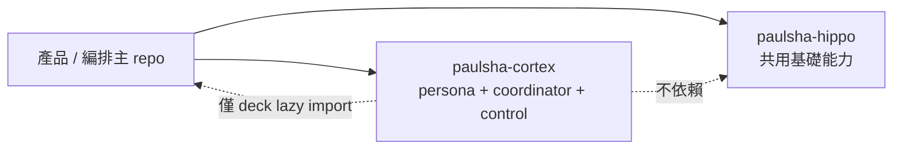

# paulsha-cortex

`paulsha-cortex` 是治理平面三件套：**persona 契約**、**coordinator 派工**、**control 檔案契約**。它把可移植的治理邏輯拆成獨立套件，讓主 repo 專注在產品行為，並把 Stage 3/4 的 guardrail 與 manager control plane 以零第三方 runtime 依賴方式出貨。

## 定位



- **主產品 repo**：產品與 orchestration 上游，之後可 pin 本 repo commit SHA 做遷移刀。
- **paulsha-cortex**：治理平面抽離包，提供 `cortex` CLI、persona scope guardrail、manager runtime 與檔案契約。
- **paulsha-hippo**：既有共用基礎能力；本 repo 已剪除 lifecycle / idle / paths 依賴，只保留 `persona.loader` 的 deck lazy import fail-open 契約。

## Install

```bash
pipx install git+https://github.com/hamanpaul/paulsha-cortex.git
```

也可在專案內直接安裝：

```bash
python -m pip install .
```

## Usage

1. 安裝 systemd `--user` 單元（冪等）：

   ```bash
   cortex install service --instance demo --interval 300
   ```

2. 啟動 / 查狀態：

   ```bash
   systemctl --user start demo-manager.timer
   systemctl --user status demo-manager.timer
   ```

3. 使用 coordinator CLI：

   ```bash
   cortex jobs
   cortex ready --specs-dir ~/.agents/specs
   ```

> 目前尚無獨立的 `cortex status` 服務查詢子命令；service 狀態以 `systemctl --user status` 為準。

## Path 契約

| 介面 | 預設路徑 | 環境變數 |
| --- | --- | --- |
| control root | `~/.agents/control` | `PSC_CONTROL_ROOT` |
| coordinator root | `~/.agents/coordinator` | `PSC_COORDINATOR_ROOT` |
| specs root | `~/.agents/specs` | `PSC_SPECS_ROOT` |
| repo root | 目前工作目錄 | `PSC_REPO_ROOT` |
| worktree root | `<repo>-worktrees` sibling | `PSC_WORKTREE_ROOT` |

共同前綴 `PSC_AGENTS_ROOT` 可一次覆寫 `~/.agents`；installer 也會建立 `~/.agents/core/runtime` 與 `~/.config/systemd/user` 需要的單元檔。

## 誠實狀態表

| 面向 | 現況 |
| --- | --- |
| persona enforcement | `shadow`；只觀測、不阻擋，翻牌到 enforce 另案處理 |
| manager service install | `cortex install service` 已可 render / copy / enable，systemd 不可用時會 graceful 落檔 |
| coordinator runtime | `dispatch` / `jobs` / `stat` / `ready` / `fanout` / `complete` / `tick` 已平移 |
| deck 驗證 | fail-open lazy import；deck 缺席時跳過 shadow 卡片比對 |
| 依賴模型 | `dependencies = []`；runtime 不依賴 `paulsha-hippo` |

## 開發備註

- repo 宣告 `tier: shareable`，所有範例與測試都必須維持去識別化。
- agent 慣例檔採 symlink 模式：`AGENTS.md`、`GEMINI.md`、`.github/copilot-instructions.md` 都指向 `CLAUDE.md`。

## Version

套件版本以 repo 根目錄 `VERSION` 為單一真相源；bootstrap 期間維持 `0.0.0`，待後續 feature batch 合併後再依 flat profile 做 patch/minor bump。
