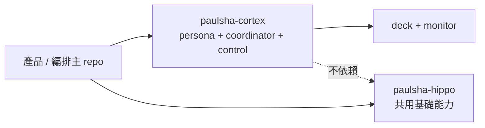

# paulsha-cortex

`paulsha-cortex` 是治理平面三件套：**persona 契約**、**coordinator 派工**、**control 檔案契約**。它把可移植的治理邏輯拆成獨立套件，讓主 repo 專注在產品行為，並把 Stage 3/4 的 guardrail、manager control plane、deck / monitor 以最小 runtime 依賴方式出貨。

## 定位



- **主產品 repo**：產品與 orchestration 上游，之後可 pin 本 repo commit SHA 做遷移刀。
- **paulsha-cortex**：治理平面抽離包，提供 `cortex` CLI、persona scope guardrail、manager runtime、deck / monitor 與檔案契約。
- **paulsha-hippo**：既有共用基礎能力；本 repo 已剪除 runtime 依賴，僅保留檔案契約層級的整合。

persona 是 manager 與 guardrail 共同引用的**角色契約資料**（role profile + scope subject），不是執行中的 agent session；真正執行的是 AgentInstance，真正做安全判斷的是 guardrail / policy engine，它們只讀 persona 契約做 enforcement。

## Install

需求：Python 3.10+、Git，以及至少一個已安裝並登入的 headless executor CLI（`copilot`、`claude` 或 `codex`）。套件只安裝 Python runtime，不會代裝或登入 executor。

```bash
pipx install git+https://github.com/hamanpaul/paulsha-cortex.git
cortex --help
```

也可在專案內直接安裝：

```bash
python -m pip install .
```

## Usage

1. 在被治理的目標 git repo 安裝 systemd `--user` 單元：

   ```bash
   cd /path/to/target-repo
   cortex install service \
     --instance cortex \
     --repo-root "$(git rev-parse --show-toplevel)"
   ```

   Installer 會 render/copy units、執行 `daemon-reload`，並 enable manager timer 與 monitor service；**不會 start service**。`--interval` 只調整 deprecated timer 的 `OnUnitActiveSec`；長駐 daemon 的 tick 週期由 `PSC_MANAGER_INTERVAL_SECONDS` 控制。

2. 啟動 manager 並分別檢查 service/runtime 狀態：

   ```bash
   systemctl --user start cortex-manager.service cortex-manager.timer
   systemctl --user status cortex-manager.service
   cortex status | jq
   ```

   可在 `$HOME/.agents/core/runtime/cortex-manager.env` 加入 operator 設定；installer 重跑時會保留非 managed keys：

   ```dotenv
   PSC_MANAGER_EXECUTOR=codex
   PSC_MANAGER_INTERVAL_SECONDS=300
   ```

3. 使用 Deck 先 dry-run，再 emit `dispatch: hold` specs：

   ```bash
   cortex deck compile feature-oneshot --task "example feature" --change example-feature
   cortex deck compile feature-oneshot --task "example feature" --change example-feature --emit
   ```

4. 完成 interactive checklist，將 spec 的 glob plan 改為確切路徑，補齊 `target_branch` / `verification` 後才翻成 `dispatch: auto`，再執行一次完整 tick：

   ```bash
   cortex ready --specs-dir "$HOME/.agents/specs" | jq
   cortex tick \
     --specs-dir "$HOME/.agents/specs" \
     --executor codex \
     --model "<builder-model-id>" \
     --review-executor claude \
     --review-model "<reviewer-model-id>"
   ```

5. Project Monitor 是選配功能。啟動前先建立 `$HOME/.agents/config/paulsha/project-cortex.yaml`；workspace path 應指向「包含各 repo 的父目錄」：

   ```yaml
   workspaces:
     - name: projects
       path: /path/to/workspace
   monitor:
     poll_interval_seconds: 60
     rescan_interval_seconds: 300
     legacy_policy: hide
   ```

   ```bash
   cortex monitor --once | jq
   systemctl --user start cortex-monitor.service
   systemctl --user status cortex-monitor.service
   ```

6. 日常查詢：

   ```bash
   cortex status | jq
   cortex jobs
   cortex stat "$JOB_ID"
   cortex list --state todo --explain
   cortex doctor --probe-live --repo owner/repo --json
   ```

   新的 Work Item read model 使用 `topic → todo → on-going → done` 四態；日常操作、override、snapshot/registry migration 與 delivery gate 詳見 [Unified Work Lifecycle 操作與遷移](docs/unified-work-lifecycle.md)。所有工作預設 manual，只有 confirmed Todo 對應到帶 `cortex:auto-on-going` label 的 confirmed issue 才能 auto claim。

> `cortex status` 查 manager 的工作與 gate 狀態；`systemctl --user status` 只查 service 是否存活，兩者不可互相替代。`fanout` / `tick` / `complete` / `slice-action` 的 CLI 最多等 control response 5 秒；timeout 後 daemon 可能仍在工作，應回到 `cortex status` 查證。

## 從使用者角度操作

### Cortex 管的是什麼？

Cortex 不是 Jira / Notion 式的任務資料庫，而是以檔案為主的 Agent 派工與交付治理平面。使用者會接觸四種不同層次：

| 層次 | 代表什麼 | 主要觀察方式 |
| --- | --- | --- |
| Spec | 任務意圖、plan、相依、驗證契約 | `~/.agents/specs/*.md` / `cortex ready` |
| Job | 一次 Agent process 執行嘗試 | `cortex jobs` / `cortex stat` |
| Slice | 從 build、verification、review 到交付的生命週期 | `cortex status` 的 `slices` / `attention` |
| Project Monitor | 從 GitHub、Todo／spec／plan、active OpenSpec 與 workflow registry 投影跨 repo Work Item | `cortex list` / `cortex work show` |

Project Monitor 不會代替 coordinator 狀態：前者提供 `topic`／`todo`／`on-going`／`done` read model，後者仍是 workflow 的唯一 writer。可用下列 read-only CLI 查詢；同一 `work-id` 若跨 repo 重複，`show` 必須加 `--repo`：

```bash
cortex list --repo hamanpaul/paulsha-cortex --state on-going --explain
cortex work show unified-work-lifecycle --repo hamanpaul/paulsha-cortex --json
```

Monitor 只允許 override、frontmatter、GitHub closing reference 與通過typed refs驗證的workflow metadata提供 confirmed association；override exclusion 優先抑制所有同work的 confirmed edge。PR body、issue title、artifact／branch slug 等 fuzzy 訊號只顯示。未被 confirmed mapping 擁有的 archived OpenSpec 與 closed GitHub issue／PR 只提供終態證據，不會單獨建立 work item。`done` 的 Todo completion 只採遠端 default branch 的 Todo blob與 archived OpenSpec task checklist revision，不採本機 overlay；所有 mapped PR 都必須是至少雙 parent且可證明已進 default branch 的 merge commit，且 CompletionRecord 保存的 source revisions、PR candidate與merge revision必須逐一符合目前remote truth；所有 mapped OpenSpec refs 也必須完成 archive。GitHub 或其他 authority provider degraded／超過 `provider_stale_after_seconds` 未成功更新時，會保留 last-good state並加上 degraded facet；`cortex-work/v1.hard_gates`只依查詢中的repo/work item authority關閉auto claim與merge，跨repo整體狀態另由`fleet_health`回報。

Monitor 採 last-good 語意：workspace 或 project subtree 暫時無法讀取時，既有項目會保留並帶 `degraded` scan signal，不會發布 removal；只有後續成功掃描父層、確認項目真的消失時才移除。`poll_interval_seconds`、`rescan_interval_seconds` 與 `watch_debounce_ms` 必須全部大於零，錯誤設定會在 service 啟動前直接失敗。

### 1. 建立任務

先用 Deck 把一個工作流編譯成 slice specs：

```bash
cortex deck list

# 先 dry-run 預覽
cortex deck compile feature-oneshot \
  --task "example feature 實作" \
  --change example-feature

# 確認後寫入 ~/.agents/specs/
cortex deck compile feature-oneshot \
  --task "example feature 實作" \
  --change example-feature \
  --emit
```

Deck 產生的 spec 預設為 `dispatch: hold`，不會立即派工。翻成 `dispatch: auto` 前，使用者應：

1. 完成 Deck 列出的 interactive checklist。
2. 確認 `plan`、`depends_on`、`target_branch` 與 `verification` 契約。
3. 執行 Deck 列出的 verify commands。
4. 只將允許 manager 派工的 spec 改為 `dispatch: auto`。

Manager 只會派送「已翻 auto、有 plan、相依全部 completed」的 slice。不要使用低階 `cortex dispatch`；它因缺少 spec / verification metadata 已停用。

### 2. 派工與執行 gate

先確認 ready set，再明確指定 builder 與 foreign reviewer：

```bash
cortex ready --specs-dir "$HOME/.agents/specs" | jq

cortex tick \
  --specs-dir "$HOME/.agents/specs" \
  --executor codex \
  --model "<builder-model-id>" \
  --review-executor claude \
  --review-model "<reviewer-model-id>"
```

`tick` 會依序處理 ready fanout、既有 Job 輪詢、deterministic verification、必要的 foreign review 與 completion 判斷。`--model` / `--review-model` 原樣傳給 executor，能否使用仍取決於該 CLI 與帳號權限。不要在一般操作加入 `--allow-unsafe`；它會旁路 executor approval/sandbox，且只允許單一 ready slice canary。

### 3. 觀察任務狀態

```bash
# Manager 綜合狀態：ready / held / in-flight / slices / attention
cortex status | jq

# Job 執行歷史與單筆詳情
cortex jobs | jq
cortex stat "$JOB_ID" | jq

# 只列出目前可派送的 specs
cortex ready --specs-dir ~/.agents/specs | jq

# 從專案文件重新推導專案進度
cortex monitor --once | jq

# 確認長駐服務存活
systemctl --user status cortex-manager.service cortex-monitor.service
```

`cortex status` 是日常主入口：

- `ready`：已滿足派工條件。
- `held`：尚未可派工，並列出 `no-plan`、`dispatch-hold` 或未滿足的 dependency。
- `in_flight`：正在執行的 Job。
- `slices`：交付生命週期、gate、Candidate 與 evidence 摘要。
- `attention`：全部 `needs_human` 項目，包含 reason 與當下合法的 `next_actions`。
- `recent_done`：最近完成或進入 terminal gate 的 slice 摘要。

Job `exited` 只代表 Agent process 以 exit code 0 結束，**不代表任務交付完成**。只有 Slice 通過 deterministic verification、必要的 foreign review，且 Candidate 已進入 target branch 後，才會變成 `completed` 並釋放下游 dependency。

### 4. 處理 `needs_human`

先從 `cortex status` 的 `attention[].next_actions` 選擇當下允許的動作，不要手動改 `jobs.json`：

```bash
cortex slice-action "$SLICE_ID" retry-build  --actor operator
cortex slice-action "$SLICE_ID" retry-verify --actor operator
cortex slice-action "$SLICE_ID" retry-review --actor operator
cortex slice-action "$SLICE_ID" abandon      --actor operator
```

`fanout`、`tick`、`complete`、`slice-action` 與 `work` 都會寫入 control request queue，再由 daemon / manager 這個單一 writer 改變狀態；daemon 未啟動時會明確拒絕，不會由 CLI 直接競寫 registry。

Work lifecycle mutation 使用 `cortex work <link|unlink|start|resume|retry-build|auto|review-attest|ship> <work-id> --repo <owner/repo>`。`link` / `unlink` 以 `--kind <github_issue|github_pr|openspec|path> --ref <canonical-ref>` 指定來源，`--issue N` 僅保留一個 release 的相容入口，兩者不得混用；一般 link/start/resume 由 installer/Monitor registry 解析 trusted repo root。`retry-build` 的 payload 只接受 `expected_candidate` CAS，`review-attest` 的review摘要與 `ship` 的 exact evidence refs 也由 `--payload <json>` 傳入。CLI 只排隊，confirmed Todo/issue authority、GitHub label、official OpenSpec archive、preflight、current-HEAD review、merge 與 remote closure 都由 Manager 驗證及執行。

Manager periodic tick 會從 durable Monitor snapshot 執行 auto-claim scan；它會讀取 work item 的全部 mapped issues，任一張帶 `cortex:auto-on-going` 即符合 label 條件，但任一 GitHub API read 失敗會讓整個 claim fail-closed。`cortex work auto ... --enable|--disable` 未指定 legacy `--issue` 時會對全部 mapped issues 套用相同 label mutation；任一 mutation 失敗時整個 action 報錯。缺 issue 的 confirmed Todo 會持久化為 `needs_human: missing_issue`，待 operator link 且 Monitor snapshot 更新後才能 resume。Run 的 claim key 綁定該 work item 的 canonical semantic authority（provider/source revisions 與 confirmed refs），不綁 whole-fleet snapshot hash；只有 sequence、written-at 或其他 repo 噪音的 snapshot refresh 會原 run resume 並更新 provenance，語意來源變更才建立新 run。

`ship` 的 `pr_number`、`change`、`todo_paths` 必須與 current WorkAuthority 的 confirmed refs 完全相同，第一次 ship 後即成為 immutable delivery binding。V1 每個 run 只支援唯一一張 PR、唯一一個 OpenSpec change 與唯一一個 Todo path；任一類有多個 confirmed target 時轉為 `needs_human: multiple-delivery-targets-unsupported`，不會以其中一個 target 寫 CompletionRecord 或投影 done。Manager 會用 authenticated `gh api` 更新既有 mapped PR 的 zh-TW conventional title、body 與 labels，再逐欄 reread；body 必須用 closing keyword涵蓋全部 mapped issues。Checks、statuses與reviews的REST pagination使用`--paginate --jq '.'`逐頁JSON stream，不依賴`gh api --slurp`；任一頁無法解碼仍fail-closed。`repo_root` 必須恰好等於 canonical `git rev-parse --show-toplevel` realpath，且 `origin` 對應同一 `owner/name`。

Merge authorization 只雜湊 stable preflight 結果（argv、return code、HEAD、tree 與 gate outcome）及 immutable evidence hashes，不納入 stdout、stderr 或 duration。若 Manager 在 `merge-authorized` 後 crash，restart 會先以唯讀 authorization record 與 authenticated merge status reconcile；已合併時不重寫 PR metadata，也不重跑可能漂移的 preflight output。

### 5. 由 Manager 完成交付

Work Item workflow 通過 build、deterministic verification 與 foreign review 後，由 Manager 依序 archive OpenSpec、跑 policy/pinned preflight、建立或更新 PR，再要求恰好一種current-HEAD delivery review：authenticated Copilot review，或透過`review-attest`建立的immutable maintainer evidence。Manager接著重讀checks、threads、closing refs與mergeability；只有全部gate對同一HEAD成立時才執行merge commit。Maintainer evidence保留`maintainer-review` kind，絕不偽裝成Copilot。

Headless build card會在dispatch前解析declared inputs。異質brainstorm發布的新artifact會先由canonical brainstorm evidence的ref/kind/hash與不可變發證source revision原子併入WorkflowRun planning authority；legacy active run也只透過相同evidence reconcile，不從mutable檔案猜測。後續PR refresh即使更新run目前source revision，也不會改寫planning發證revision；brainstorm-required run缺evidence一律停止。Accepted planning artifact只接受該authority的ref/hash；獨立builder worktree缺檔時由Manager原子seed。Codex固定使用`workspace-write`；workflow中`commit_policy=required`的builder，以及legacy fanout／dispatch／retry-build的builder persona，取得明確commit capability，linked worktree才額外開放Git驗證出的current worktree gitdir、shared objects、current branch ref與reflog parent directories。Launcher會清除inherited Git repository selectors；planner、verify與review不取得這些Git write directories，symlink、detached HEAD或invalid metadata一律拒絕required-commit launch。Job、versioned bounded prompt與canonical evidence保存同一份input snapshot，terminalize再驗hash。Build card可把Candidate單調推進到目前Candidate的exact descendant worktree HEAD；verify/review仍須完全等於凍結Candidate。Dead job，或plan/build workflow card以schema/binding正確的terminal明示`failed|needs_human`，轉`needs_human`後periodic runner都不會自動重派；explicit resume保留舊job/log並重試同一run/card。若已完成的Candidate在delivery preflight才發現真實缺陷，operator可用`retry-build`加上exact `expected_candidate`；Manager只在ongoing `needs_human` verify/review run、無active job且舊build全部passed時，以窄化registry recovery原子重開最後一張builder card，清除舊verify/review/delivery authority，並要求新HEAD為舊Candidate的descendant。Dispatch失敗會恢復stop facet，必須修正authority後再由operator重試。

Merge 後 Manager 會重新 fetch default branch，驗證雙親 merge commit ancestry、issue closed、active OpenSpec 消失、archive/Todo/CompletionRecord 成立。部分完成不會提早標 `done`。

### 目前邊界

- 沒有 Web UI；任務意圖仍以 Markdown spec 維護。
- Copilot finding 只允許兩輪 bounded fix/re-review；超過預算需由 operator recovery。Maintainer路徑仍要求ForeignReview、terminal-green checks與resolved/outdated threads。
- verification 的 sanitized env 不等於 network / filesystem sandbox。
- v1 自動 foreign review 限 `tier: shareable`。
- merge commit 是目前受支援路徑；auto/squash/rebase/cherry-pick 會 fail-closed。
- installer/service 尚無 periodic builder/reviewer model pin；需要固定 model 時，使用帶 `--model` / `--review-model` 的手動 `cortex tick`。

尚未實作的 operator bootstrap、model pin、monitor init、instance/path isolation、state migration 與 async request UX 統一追蹤於 [issue #12](https://github.com/hamanpaul/paulsha-cortex/issues/12)，供後續 OpenSpec / implementation plan 使用。

## Coordinator dispatch discipline（v1）

### Job / Slice / Gate 狀態語意

| 層級 | 狀態 | 語意 |
| --- | --- | --- |
| Job | `dispatched` / `running` / `exited` / `failed` | process 執行結果；`exited` **不等於**交付完成 |
| Slice | `pending` / `building` / `reviewing` / `verified` / `completed` / `needs_human` / `failed` | 交付生命週期與 release gate |
| Gate | `pending` / `passed` / `needs_human` / `failed` | verification + foreign review 的決策狀態 |

依賴釋放只接受 `slice_state=completed` 且 CompletionRecord / hash / target ancestry 全部一致；單純 Job `exited` 永遠不能滿足 DAG。

### Verification frontmatter 與 trust boundary（shareable-only）

```yaml
---
dispatch: auto
slice_id: auth-hardening
plan: docs/superpowers/plans/auth-hardening.md
target_branch: main
verification:
  docs_class: code
  required_artifacts:
    - path: reports/policy.json
      must_change: true
  checks:
    - kind: persona-scope
    - kind: command
      name: policy
      argv: [python3, -m, pytest, -q, tests/policy.py]
      cwd: .
      timeout_seconds: 30
  tests: []
  full_suite:
    argv: [python3, -m, pytest, -q]
    cwd: .
    timeout_seconds: 60
    baseline: no-regression
---
```

- v1 只支援 `tier: shareable`；非 shareable 會 fail-closed 到 `needs_human`。
- verification command 只接受 typed argv（`shell=False`）；採 sanitized env，但這不是 sandbox，不保證隔離 untrusted code。

### Foreign reviewer identity（不同 independence domain）

`PSC_PROJECT_CONFIG_ROOT/model-identities.yaml`：

```yaml
schema_version: 2
identities:
  - executor: agy
    model_id: Gemini 3.1 Pro (High)
    independence_domain: google
    capabilities: [planning]
    live_probe: agy-plan-sandbox
  - executor: codex
    model_id: "<builder-model-id>"
    independence_domain: "<builder-domain>"
    capabilities: [planning, build]
  - executor: claude
    model_id: "<reviewer-model-id>"
    independence_domain: "<different-reviewer-domain>"
    capabilities: [planning, review]
```

- schema v1 仍可讀取並由 runtime 正規化；新設定使用 schema v2 的 `capabilities` / `live_probe`。packaged registry 已登錄 canonical agy identity，自訂檔不得以不同內容 shadow 它。
- planner/builder/reviewer 必須是 explicit `(executor, model_id)` 且可解析；agy 只有在 `doctor --probe-live` 的 model discovery 與 plan/sandbox smoke 都吻合時才可用。
- workflow reviewer 只會選擇明示 `capabilities: [review]` 且與 Builder 不同 independence domain 的 schema v2 identity；legacy v1 identity 只取得 planning capability，不能被猜成 reviewer。
- Verify/Review 以 executor 的 enforced read-only mode在exact Candidate的remote-free disposable clone檢查；Claude reviewer固定使用`dontAsk`與`safe-mode`，只暴露OS-sandboxed Bash並要求structured JSON object，不載入Candidate `CLAUDE.md`/skills/plugins/MCP/remote session，也不進Plan Mode。Filesystem預設拒讀整個home、`/run/user`與Docker sockets，只重開Candidate與Python user-site工具鏈，並對Candidate clone設deny-write；review subprocess只保留`PATH`、`HOME`、locale、`TMPDIR`、`VIRTUAL_ENV`等非密鑰基礎環境，且不啟動login shell。Linux/WSL host必須安裝`bubblewrap`、`socat`與官方sandbox runtime（Ubuntu可用`sudo apt-get install bubblewrap socat`，再用`npm install -g @anthropic-ai/sandbox-runtime`）；任一依賴缺失、Unix-socket seccomp失效或命令要求unsandboxed fallback都拒絕啟動。Manager在所有terminal/launch failure/operator retry路徑重驗原Candidate完整tree snapshot後清除clone。agent只回傳substantive result、findings與inline report body；report僅能發布至phase專屬的`reports/verify/*.md`或`reports/review/*.md`，並由durable publication journal把多檔CAS、canonical evidence與registry bind組成可rollback/roll-forward的transaction。Manager會從durable Job注入Candidate、builder/reviewer job ID與launch identity，agent不取得report或Candidate寫入權。
- `cortex doctor`會在identity registry配置Claude `review` capability時把Claude Code 2.1.187+、必要CLI flags、`bubblewrap`、`socat`與`srt`執行能力列為required probe；`--probe-live`另跑native read-only與Unix-socket seccomp smoke。沒有Claude reviewer的部署只顯示非必要warn。Claude的protected bind targets位於deterministic disposable session root，exact Candidate則固定在其無污染的`candidate/` checkout。
- 同 domain、未知 identity、缺 model 都會得到 `foreign-review-absent`（fail-closed）。

### Merge 限制與 completion/restart

- v1 只支援 preserving-commit 路徑：Candidate 必須是 `refs/remotes/<remote>/<target_branch>` 的 ancestor；squash/cherry-pick 視為不支援（保持 blocked 或 needs_human）。
- 同一 dependency chain 必須使用同一 target branch，否則 fail-closed。
- completion ordering 固定為「先 atomic 寫 CompletionRecord，再 atomic 標 Slice `completed`」。
- work delivery CompletionRecord 另綁定 repo/work/run ID、workflow step IDs、Monitor snapshot/provider/source revisions、mapped issues、PR/OpenSpec/Todo refs、merge commit，以及 trusted preflight/current-HEAD delivery review/ForeignReview/merge-authorization refs；cached done 每次仍會重新讀取 fresh authority 與 remote closure。
- merge 前 Manager 會先以 atomic no-clobber+fsync 寫入唯讀 `merge-authorized` evidence file（authority digest、HEAD/tree、實際review kind/ref/hash、ForeignReview/preflight/checks hashes），再把 path/hash 綁回 run state。Crash replay 只接受 exact record；未經 Manager authorization 的 external merge 會進入 `needs_human`，不會直接閉合。
- crash window（record 已寫、slice 尚未 completed）在 restart 後只會補完符合當前 target ancestry 的紀錄；不符合則維持 blocked。
- 舊版無 `schema_version` / legacy `done` state 需先 clean-start（archive/remove 舊 `jobs.json`），不做 silent migration。

### Operator actions 與 status / attention

```bash
cortex slice-action "$SLICE_ID" retry-build  --actor "$ACTOR"
cortex slice-action "$SLICE_ID" retry-verify --actor "$ACTOR"
cortex slice-action "$SLICE_ID" retry-review --actor "$ACTOR"
cortex slice-action "$SLICE_ID" abandon      --actor "$ACTOR"

# PR已建立且foreign review綁定current HEAD後，建立typed maintainer evidence：
cortex work review-attest "$WORK_ID" --repo "$REPO" --actor "$ACTOR" \
  --payload review-attest.json
```

`review-attest.json`只接受`{"verdict":"approved","summary":"...","findings":[]}`；path/hash由Manager生成，caller不得注入。Manager會重讀authenticated PR HEAD並將evidence綁定repo/work/run/authority/PR/candidate/actor。

- `slice-action` 一律透過 control request queue，由 daemon/manager 單一 writer 消費。
- status snapshot 會一次列出所有 `needs_human` 事項（`attention`），包含 reason、evidence refs、ancestry 摘要與 `next_actions`，不需逐筆互動追問。

### Broker cleanup（best-effort）

- `cortex reap-brokers` 預設 dry-run。
- `--apply` 必須搭配 `--cwd-root <realpath>`，只允許 scoped project 下的 broker 候選。
- signal 前會重驗 `ppid/start-time/cmdline/cwd`；僅送 `SIGTERM`，不做 escalation。PID reuse / race 只提供 best-effort 安全保護。

## Monitor registry merge

- manual config：`~/.agents/config/paulsha/project-cortex.yaml`
- shared hippo registry：`~/.agents/config/paulsha/project-hippo.yaml`
- merge 規則：兩份 registry 以 realpath 去重，**manual entry 優先**保留 metadata；兩者皆缺時 `cortex monitor` 會直接報錯。

## Path 契約

| 介面 | 預設路徑 | 環境變數 |
| --- | --- | --- |
| control root | `~/.agents/control` | `PSC_CONTROL_ROOT` |
| coordinator root | `~/.agents/coordinator` | `PSC_COORDINATOR_ROOT` |
| specs root | `~/.agents/specs` | `PSC_SPECS_ROOT` |
| run root | 依 `PSC_INSTANCE`（預設`cortex`）讀installer env；未安裝時為`~/.agents/run/<instance>` | `PSC_RUN_ROOT`（最高優先） |
| monitor state root | `~/.agents/monitor` | `PSC_MONITOR_STATE_ROOT` |
| config root | `~/.config/paulshaclaw` | `PSC_CONFIG_ROOT` |
| project config root | `~/.agents/config/paulsha` | `PSC_PROJECT_CONFIG_ROOT` |
| repo root | 目前工作目錄 | `PSC_REPO_ROOT` |
| worktree root | `<repo>-worktrees` sibling | `PSC_WORKTREE_ROOT` |

共同前綴 `PSC_AGENTS_ROOT` 可一次覆寫 mutable/runtime roots。systemd unit 依宣告順序讀取 `~/.agents/core/runtime/<instance>.env` 與固定 bootstrap `~/.agents/core/runtime/<instance>-manager.env`；installer在後者持久化`PSC_INSTANCE`與`PSC_AGENTS_ROOT`。Interactive CLI以同一`PSC_INSTANCE`選取bootstrap env，不掃描猜測其他instance；symlink、malformed或relative root會fail-closed。installer重跑會更新自身管理的Python/repo值，但保留既有operator roots。Monitor socket預設為`$PSC_RUN_ROOT/project-monitor.sock`，也可由`project-cortex.yaml`的`monitor.socket_path`覆寫；production `MonitorSocketClient`與service使用相同config解析。

## 誠實狀態表

| 面向 | 現況 |
| --- | --- |
| persona enforcement | standalone PR workflow 為 `shadow`；coordinator verification 的 `persona-scope` 為 fail-closed gate |
| manager service install | `cortex install service` 會 render / copy / enable，但不會 start；systemd 不可用時只落檔 |
| coordinator runtime | `jobs` / `stat` / `ready` / `status` 為讀取路徑；`fanout` / `complete` / `tick` / `slice-action` / `work` 走 control queue；舊低階 `dispatch` 已停用 |
| deck 驗證 | compile 只產生 `dispatch: hold` 骨架；verify 只檢查 `produces` glob 存在性，不驗內容 |
| monitor registry | `project-cortex.yaml` ⊍ `project-hippo.yaml`，realpath 去重且 manual 優先 |
| 依賴模型 | 僅 `PyYAML`；runtime 不依賴 `paulsha-hippo` |

## 開發備註

- repo 宣告 `tier: shareable`，所有範例與測試都必須維持去識別化。
- agent 慣例檔採 symlink 模式：`AGENTS.md`、`GEMINI.md`、`.github/copilot-instructions.md` 都指向 `CLAUDE.md`。

## Version

套件版本以 repo 根目錄 `VERSION` 為單一真相源；bootstrap 期間維持 `0.0.0`，待後續 feature batch 合併後再依 flat profile 做 patch/minor bump。
