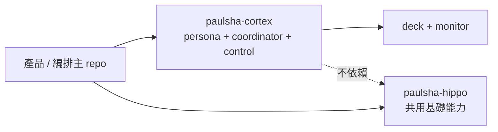

# paulsha-cortex

`paulsha-cortex` 是治理平面三件套：**persona 契約**、**coordinator 派工**、**control 檔案契約**。它把可移植的治理邏輯拆成獨立套件，讓主 repo 專注在產品行為，並把 Stage 3/4 的 guardrail、manager control plane、deck / monitor 以最小 runtime 依賴方式出貨。

## 定位



- **主產品 repo**：產品與 orchestration 上游，之後可 pin 本 repo commit SHA 做遷移刀。
- **paulsha-cortex**：治理平面抽離包，提供 `cortex` CLI、persona scope guardrail、manager runtime、deck / monitor 與檔案契約。
- **paulsha-hippo**：既有共用基礎能力；本 repo 已剪除 runtime 依賴，僅保留檔案契約層級的整合。

persona 是 manager 與 guardrail 共同引用的**角色契約資料**（role profile + scope subject），不是執行中的 agent session；真正執行的是 AgentInstance，真正做安全判斷的是 guardrail / policy engine，它們只讀 persona 契約做 enforcement。

## Install

```bash
pipx install git+https://github.com/hamanpaul/paulsha-cortex.git
```

也可在專案內直接安裝：

```bash
python -m pip install .
```

## Usage

1. 安裝 systemd `--user` 單元（冪等；一次佈署 manager timer + monitor service）：

   ```bash
   cortex install service --instance demo --interval 300
   ```

2. 啟動 / 查狀態：

   ```bash
   systemctl --user start demo-manager.timer
   systemctl --user start demo-monitor.service
   systemctl --user status demo-manager.timer
   systemctl --user status demo-monitor.service
   ```

3. 使用 deck：

   ```bash
   cortex deck compile feature-oneshot --task "demo"
   cortex deck verify openspec-archive --task-slug demo-task --change sample-change
   ```

4. 監看 project 狀態：

   ```bash
   cortex monitor --once
   cortex monitor
   ```

5. 使用 coordinator CLI：

   ```bash
   cortex jobs
   cortex ready --specs-dir ~/.agents/specs
   ```

> `cortex status` 查的是 manager 任務狀態；`systemctl --user status` 查的是 service 是否存活，兩者用途不同。

## 從使用者角度操作

### Cortex 管的是什麼？

Cortex 不是 Jira / Notion 式的任務資料庫，而是以檔案為主的 Agent 派工與交付治理平面。使用者會接觸四種不同層次：

| 層次 | 代表什麼 | 主要觀察方式 |
| --- | --- | --- |
| Spec | 任務意圖、plan、相依、驗證契約 | `~/.agents/specs/*.md` / `cortex ready` |
| Job | 一次 Agent process 執行嘗試 | `cortex jobs` / `cortex stat` |
| Slice | 從 build、verification、review 到交付的生命週期 | `cortex status` 的 `slices` / `attention` |
| Project Monitor | 從專案 workstream / todo / archive 推導的專案進度 | `cortex monitor --once` |

Project Monitor 不會代替 coordinator 狀態：前者觀察專案文件，後者追蹤 Agent 執行與交付 gate。

### 1. 建立任務

先用 Deck 把一個工作流編譯成 slice specs：

```bash
cortex deck list

# 先 dry-run 預覽
cortex deck compile feature-oneshot \
  --task "example feature 實作" \
  --change example-feature

# 確認後寫入 ~/.agents/specs/
cortex deck compile feature-oneshot \
  --task "example feature 實作" \
  --change example-feature \
  --emit
```

Deck 產生的 spec 預設為 `dispatch: hold`，不會立即派工。翻成 `dispatch: auto` 前，使用者應：

1. 完成 Deck 列出的 interactive checklist。
2. 確認 `plan`、`depends_on`、`target_branch` 與 `verification` 契約。
3. 執行 Deck 列出的 verify commands。
4. 只將允許 manager 派工的 spec 改為 `dispatch: auto`。

Manager 只會派送「已翻 auto、有 plan、相依全部 completed」的 slice。不要使用低階 `cortex dispatch`；它因缺少 spec / verification metadata 已停用。

### 2. 觀察任務狀態

```bash
# Manager 綜合狀態：ready / held / in-flight / slices / attention
cortex status | jq

# Job 執行歷史與單筆詳情
cortex jobs | jq
cortex stat <job-id> | jq

# 只列出目前可派送的 specs
cortex ready --specs-dir ~/.agents/specs | jq

# 從專案文件重新推導專案進度
cortex monitor --once | jq

# 確認長駐服務存活
systemctl --user status cortex-manager.service cortex-monitor.service
```

`cortex status` 是日常主入口：

- `ready`：已滿足派工條件。
- `held`：尚未可派工，並列出 `no-plan`、`dispatch-hold` 或未滿足的 dependency。
- `in_flight`：正在執行的 Job。
- `slices`：交付生命週期、gate、Candidate 與 evidence 摘要。
- `attention`：全部 `needs_human` 項目，包含 reason 與當下合法的 `next_actions`。
- `recent_done`：最近完成或進入 terminal gate 的 slice 摘要。

Job `exited` 只代表 Agent process 以 exit code 0 結束，**不代表任務交付完成**。只有 Slice 通過 deterministic verification、必要的 foreign review，且 Candidate 已進入 target branch 後，才會變成 `completed` 並釋放下游 dependency。

### 3. 處理 `needs_human`

先從 `cortex status` 的 `attention[].next_actions` 選擇當下允許的動作，不要手動改 `jobs.json`：

```bash
cortex slice-action <slice-id> retry-build  --actor operator
cortex slice-action <slice-id> retry-verify --actor operator
cortex slice-action <slice-id> retry-review --actor operator
cortex slice-action <slice-id> abandon      --actor operator
```

`fanout`、`tick`、`complete` 與 `slice-action` 都會寫入 control request queue，再由 daemon / manager 這個單一 writer 改變狀態；daemon 未啟動時會明確拒絕，不會由 CLI 直接競寫 registry。

### 目前邊界

- 沒有 Web UI；任務意圖仍以 Markdown spec 維護。
- v1 不做自動 fix-loop / retry；需由使用者選擇 recovery action。
- verification 的 sanitized env 不等於 network / filesystem sandbox。
- v1 自動 foreign review 限 `tier: shareable`。
- preserving-commit merge 是目前受支援路徑；squash / cherry-pick 改變 Candidate identity 時會 fail-closed。

## Coordinator dispatch discipline（v1）

### Job / Slice / Gate 狀態語意

| 層級 | 狀態 | 語意 |
| --- | --- | --- |
| Job | `dispatched` / `running` / `exited` / `failed` | process 執行結果；`exited` **不等於**交付完成 |
| Slice | `pending` / `building` / `reviewing` / `verified` / `completed` / `needs_human` / `failed` | 交付生命週期與 release gate |
| Gate | `pending` / `passed` / `needs_human` / `failed` | verification + foreign review 的決策狀態 |

依賴釋放只接受 `slice_state=completed` 且 CompletionRecord / hash / target ancestry 全部一致；單純 Job `exited` 永遠不能滿足 DAG。

### Verification frontmatter 與 trust boundary（shareable-only）

```yaml
---
dispatch: auto
slice_id: auth-hardening
plan: docs/superpowers/plans/auth-hardening.md
target_branch: main
verification:
  docs_class: code
  required_artifacts:
    - path: reports/policy.json
      must_change: true
  checks:
    - kind: persona-scope
    - kind: command
      name: policy
      argv: [python3, -m, pytest, -q, tests/policy.py]
      cwd: .
      timeout_seconds: 30
  tests: []
  full_suite:
    argv: [python3, -m, pytest, -q]
    cwd: .
    timeout_seconds: 60
    baseline: no-regression
---
```

- v1 只支援 `tier: shareable`；非 shareable 會 fail-closed 到 `needs_human`。
- verification command 只接受 typed argv（`shell=False`）；採 sanitized env，但這不是 sandbox，不保證隔離 untrusted code。

### Foreign reviewer identity（不同 independence domain）

`PSC_PROJECT_CONFIG_ROOT/model-identities.yaml`：

```yaml
schema_version: 1
identities:
  - executor: copilot
    model_id: claude-haiku-4.5
    independence_domain: anthropic
  - executor: codex
    model_id: gpt-5.4
    independence_domain: openai
```

- builder/reviewer 必須是 explicit `(executor, model_id)` 且可解析。
- 同 domain、未知 identity、缺 model 都會得到 `foreign-review-absent`（fail-closed）。

### Merge 限制與 completion/restart

- v1 只支援 preserving-commit 路徑：Candidate 必須是 `refs/remotes/<remote>/<target_branch>` 的 ancestor；squash/cherry-pick 視為不支援（保持 blocked 或 needs_human）。
- 同一 dependency chain 必須使用同一 target branch，否則 fail-closed。
- completion ordering 固定為「先 atomic 寫 CompletionRecord，再 atomic 標 Slice `completed`」。
- crash window（record 已寫、slice 尚未 completed）在 restart 後只會補完符合當前 target ancestry 的紀錄；不符合則維持 blocked。
- 舊版無 `schema_version` / legacy `done` state 需先 clean-start（archive/remove 舊 `jobs.json`），不做 silent migration。

### Operator actions 與 status / attention

```bash
cortex slice-action <slice-id> retry-build  --actor <text>
cortex slice-action <slice-id> retry-verify --actor <text>
cortex slice-action <slice-id> retry-review --actor <text>
cortex slice-action <slice-id> abandon      --actor <text>
```

- `slice-action` 一律透過 control request queue，由 daemon/manager 單一 writer 消費。
- status snapshot 會一次列出所有 `needs_human` 事項（`attention`），包含 reason、evidence refs、ancestry 摘要與 `next_actions`，不需逐筆互動追問。

### Broker cleanup（best-effort）

- `cortex reap-brokers` 預設 dry-run。
- `--apply` 必須搭配 `--cwd-root <realpath>`，只允許 scoped project 下的 broker 候選。
- signal 前會重驗 `ppid/start-time/cmdline/cwd`；僅送 `SIGTERM`，不做 escalation。PID reuse / race 只提供 best-effort 安全保護。

## Monitor registry merge

- manual config：`~/.agents/config/paulsha/project-cortex.yaml`
- shared hippo registry：`~/.agents/config/paulsha/project-hippo.yaml`
- merge 規則：兩份 registry 以 realpath 去重，**manual entry 優先**保留 metadata；兩者皆缺時 `cortex monitor` 會直接報錯。

## Path 契約

| 介面 | 預設路徑 | 環境變數 |
| --- | --- | --- |
| control root | `~/.agents/control` | `PSC_CONTROL_ROOT` |
| coordinator root | `~/.agents/coordinator` | `PSC_COORDINATOR_ROOT` |
| specs root | `~/.agents/specs` | `PSC_SPECS_ROOT` |
| run root | `~/.agents/run` | `PSC_RUN_ROOT` |
| config root | `~/.config/paulshaclaw` | `PSC_CONFIG_ROOT` |
| project config root | `~/.agents/config/paulsha` | `PSC_PROJECT_CONFIG_ROOT` |
| repo root | 目前工作目錄 | `PSC_REPO_ROOT` |
| worktree root | `<repo>-worktrees` sibling | `PSC_WORKTREE_ROOT` |

共同前綴 `PSC_AGENTS_ROOT` 可一次覆寫 `~/.agents`；installer 也會建立 `~/.agents/core/runtime` 與 `~/.config/systemd/user` 需要的單元檔。

## 誠實狀態表

| 面向 | 現況 |
| --- | --- |
| persona enforcement | `shadow`；只觀測、不阻擋，翻牌到 enforce 另案處理 |
| manager service install | `cortex install service` 已可一次 render / copy / enable manager timer + monitor service；systemd 不可用時會 graceful 落檔 |
| coordinator runtime | `dispatch` / `jobs` / `stat` / `ready` / `fanout` / `complete` / `tick` 已平移 |
| deck 驗證 | deck 與 persona 同包；未知 card 仍以 warning 呈現 |
| monitor registry | `project-cortex.yaml` ⊍ `project-hippo.yaml`，realpath 去重且 manual 優先 |
| 依賴模型 | 僅 `PyYAML`；runtime 不依賴 `paulsha-hippo` |

## 開發備註

- repo 宣告 `tier: shareable`，所有範例與測試都必須維持去識別化。
- agent 慣例檔採 symlink 模式：`AGENTS.md`、`GEMINI.md`、`.github/copilot-instructions.md` 都指向 `CLAUDE.md`。

## Version

套件版本以 repo 根目錄 `VERSION` 為單一真相源；bootstrap 期間維持 `0.0.0`，待後續 feature batch 合併後再依 flat profile 做 patch/minor bump。
