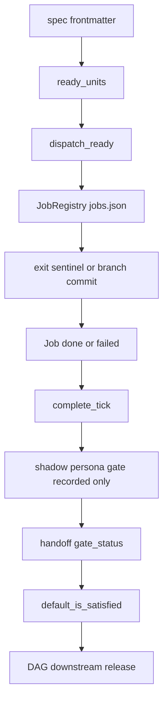
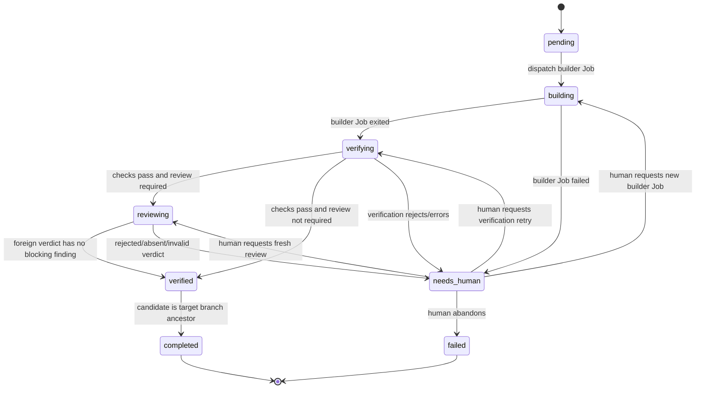

# Improve spec：強化 cortex 任務分派紀律（依 multi-agent co-work 實戰）（2026-07-12）

> 狀態：v1 implementation spec。這是 improvement，不是 greenfield；以 cortex 現行 `slice_id → JobRegistry → completion → handoff → DAG release` 資料流為邊界，只修會造成假完成、同源審查與誤釋放下游的缺口。完整自治平台留待真實 TaskRun 證據再擴充。

GitHub issue #10 是 umbrella backlog。本 spec 保留 `paulsha-hippo` 一次 9-issue 清零期間，Claude 與多家 agent/model co-work 得到的實戰心得；方法論是設計輸入，cortex 對 hippo 維持零 runtime 依賴。

## 1. 實戰來源：哪些問題真的發生過

| 實戰心得 | 觀察到的失敗 | cortex 的最小落點 |
| --- | --- | --- |
| 完成必須看結果，不是 agent 自稱或 process exit | exit 0、末筆 log 說 done，實際仍是 placeholder、缺產物或測試紅 | P0-A：deterministic ResultVerification |
| 同模型自審共享盲點 | 同源多 lens 與全綠測試仍放過 redaction、atomicity、race、rollback、crash-consistency 等真 bug | P0-B：不同 independence domain 的 ForeignReview |
| gate 會逐輪剝出更深問題 | 修前輪 finding 後，複審才看到下一層；修復本身也可能引入新缺陷 | P0-C：保留 bounded fix-loop workstream，v1 先人工重派 |
| 模型有比較優勢與成本差 | frontier 適合編排/硬修、cheaper agent 適合 bulk implementation、異質模型適合第二意見 | P1-A：保留 roster workstream，v1 只做最小 builder/reviewer mapping |
| 長跑一定會遇到 session/rate limit | 沒有 checkpoint 時只能 restart，重做已完成工作 | P1-B：保留 resume workstream，等 canary 有真實中斷證據再做 |
| process recovery 不能猜 ownership | name-pattern 很容易誤殺另一 project/worktree 的 live 工作 | P0-D：manager 不再自動跑 global reaper；operator apply 必須 scope 到 cwd root |

這些心得不能因 YAGNI 被刪掉；YAGNI 只決定「現在實作多少」，不否定問題與後續方向。

## 2. 現行架構：已由 code/test trace 確認



現況事實：

- `paulsha_cortex/coordinator/autonomy.py::parse_spec_frontmatter` 只解析 `dispatch`、`slice_id`、`plan`、`depends_on`。
- `paulsha_cortex/coordinator/registry.py::JobRegistry` 以 atomic replace 持久化 `jobs.json`，Job status 只有 `dispatched/running/done/failed`。
- `paulsha_cortex/coordinator/dispatcher.py` 的 branch polling 與 headless sentinel 都能直接把 Job 寫成 `done`。
- `paulsha_cortex/coordinator/manager.py::complete_tick` 直接把 `done` 映射成 `gate_status=passed`；gate verdict 為 false 或 gate exception 都不阻擋。
- `paulsha_cortex/coordinator/autonomy.py::default_is_satisfied` 只看 handoff `gate_status == passed`，沒有驗 upstream artifact 是否存在於 downstream base。
- `paulsha_cortex/coordinator/manager_daemon.py` 預設每輪以 `apply=True` 執行 global broker reaper；shell script 只靠 cmdline pattern + parent 判斷候選。

現有測試也明確鎖定 shadow 行為：false verdict 與 gate exception 仍寫 `passed`，隨後釋放 downstream。因此 v1 要改的是這條 load-bearing path，不是旁邊再蓋一套 Task orchestration engine。

## 3. v1 domain model：沿用現有架構

| 名詞 | v1 定義 | 持久位置 |
| --- | --- | --- |
| `SliceRecord` | 一個 `slice_id` 的最小協調狀態，串起 builder Job、verification、reviewer Job 與 completion | 擴充現有 coordinator atomic JSON state，新增 `slices`；不建立 TaskRevision/TaskRun 平台 |
| `Job` | 一次 headless agent execution；builder/reviewer 都是 Job | 現有 `jobs` list |
| `Candidate` | builder Job 產生、準備被驗證/審查的 exact commit | SliceRecord 的 `candidate_head` |
| `ResultVerification` | commit/artifact/test/scope 的 deterministic checks | verification evidence JSON |
| `ForeignReview` | 不同 independence domain 的 reviewer Job，對 exact Candidate 做語意審查 | review verdict JSON |
| `GateEvaluation` | 一個 reviewer Job 對一個 exact Candidate 的 immutable gate結果 | SliceRecord保存current evaluation ref；舊evaluation只留audit |
| `CompletionRecord` | Candidate 已 verified 且已合入 target branch的下游 readiness proof | `runtime/handoff/<slice_id>.json` |
| `ModelIdentityEntry` | explicit `(executor, model_id)` 到 `independence_domain` 的靜態映射 | P0-B 的最小 coordinator config |

SliceRecord 至少保存：`slice_id`、spec/plan path 與 hash、target branch、dispatch base、candidate head、builder/reviewer job IDs、slice state、gate state、verification/review evidence refs。所有 state write 仍由 manager 單一 writer透過現有 atomic JSON persistence 完成。

coordinator state、verification evidence、review verdict與CompletionRecord都必須帶`schema_version`。完成寫入順序固定為：(1) atomic寫CompletionRecord；(2) atomic更新SliceRecord=`completed`。`default_is_satisfied`必須同時確認SliceRecord與CompletionRecord一致，所以兩步間crash仍保持blocked；restart看到verified Slice與完全匹配的orphan record時可完成第2步，不匹配的orphan record則隔離/移除。

本repo尚無正式runtime state，因此採clean-start：新schema遇到舊/未知`jobs.json`時拒絕啟動並提供明確archive/remove指令，不做自動migration，也不得靜默清空。

v1 不建立：TaskRevision lifecycle、TaskRun aggregate、journal/snapshot平台、remote authorization、standing authorization、integration queue或自動 rollback engine。

## 4. 狀態 reference：圖看流程，表查語意

### 4.1 Job states

v1 將現行 `done` 改名為 `exited`，避免把 process completion 誤寫成 task completion。

| State | 精確定義 | Writer / 合法進入 | 合法離開 | Terminal | 對 DAG 的效果 | Restart / late result |
| --- | --- | --- | --- | --- | --- | --- |
| `dispatched` | registry row 已持久化，launcher handle 尚未確認或 process 尚未觀測為 running | manager 在 launch 前建立 | `running`、`failed` | 否 | 無 | daemon restart 後依 PID/sentinel重建；無可信 handle則 failed |
| `running` | process identity/handle 已持久化且仍存活 | launcher attach handle | `exited`、`failed` | 否 | 無 | restart 後以 sentinel/PID判斷；不得僅靠舊 PID宣稱 running |
| `exited` | 有可信 exit evidence 且 exit code為 0；只代表本次 agent execution 結束 | dispatcher poller | 無 | 是 | 無；必須由 SliceRecord 進 verification/review | late duplicate evidence冪等忽略 |
| `failed` | non-zero exit、process 消失且無可信 sentinel、launch failure | launcher/dispatcher | 無 | 是 | 無 | 新的人工 retry建立新 Job，不覆寫舊 Job |

Job history 保留為獨立 rows；v1 不實作自動 fix/retry loop，因此不需要 Attempt lineage、superseded等額外 states。

### 4.2 Slice states

| State | 精確定義 | Writer / 進入條件 | 合法離開 | Terminal | 對 DAG 的效果 | Restart / human action |
| --- | --- | --- | --- | --- | --- | --- |
| `pending` | spec ready，但尚無 active builder Job | manager 掃描 ready slice | `building`、`failed` | 否 | 無 | 可安全重新 dispatch |
| `building` | builder Job 已建立，等待 terminal Job result | manager dispatch | `verifying`、`needs_human` | 否 | 無 | 由 Job state重建；不得重派第二個 builder |
| `verifying` | builder Job exited，正在跑 deterministic checks | manager | `reviewing`、`needs_human` | 否 | 無 | evidence完整可冪等重讀；缺/壞 evidence重跑 verification |
| `reviewing` | verification passed，reviewer Job 已建立或 verdict待驗 | manager | `verified`、`needs_human` | 否 | 無 | verdict必須綁exact Candidate；stale evaluation留audit並建立fresh evaluation |
| `verified` | deterministic checks passed，且依review policy取得passed GateEvaluation或明確`not-required` proof；尚未證明合入target branch | manager | `completed`、`needs_human` | 否 | 無 | 每tick重驗target ancestry；branch ref偏離pinned Candidate則needs_human |
| `completed` | verified Candidate 是 target branch ancestor，CompletionRecord 已寫入 | manager | 無 | 是 | 唯一可滿足 `depends_on` | restart 後重驗 record schema與 ancestry；不符則 fail-closed |
| `needs_human` | verification reject、review reject/absent、stale/invalid evidence或無法安全判斷 | manager | `building`、`verifying`、`reviewing`、`failed` | 否 | 無 | v1只在本機status集中呈現；本機operator顯式retry-build/retry-verify/retry-review或abandon |
| `failed` | 人類明確 abandon，或 slice 無法再繼續 | manager/local operator | 無 | 是 | 無；downstream保持 blocked | 重新處理需建立新的 slice/spec，不復活舊 record |

### 4.3 Gate states

每個 reviewer Job 建立一個新的 GateEvaluation；evaluation terminal 後 immutable，不重設、不覆寫。Candidate/spec/plan/verification hash 改變時，舊evaluation的terminal state與內容完全不變；Slice清除current evaluation ref、記錄`stale-input` invalidation reason，再為fresh reviewer Job建立新的`pending` evaluation。`stale`不是GateEvaluation state。

| State | 精確定義 | Writer / 進入條件 | 合法離開 | Terminal | 對 Slice 的效果 | Evidence |
| --- | --- | --- | --- | --- | --- | --- |
| `pending` | verification尚未取得有效 review verdict | manager | `passed`、`rejected`、`absent` | 否 | Slice維持 reviewing | reviewer selection、subject HEAD與input hashes |
| `passed` | 有效 foreign verdict，policy分類後沒有 blocking findings | manager verdict validator | 無 | 是 | Slice可進 verified | reviewer Job/launch identity、detached HEAD、findings |
| `rejected` | verdict含至少一個 policy-classified blocking finding | manager verdict validator | 無 | 是 | Slice進 needs_human | stable finding IDs、severity、evidence |
| `absent` | 無可用異質 reviewer、provider/model身分不明、verdict schema/provenance不可信 | manager | 無 | 是 | Slice進 needs_human | 嘗試過的 reviewer與失敗原因 |

v1 不支援 agent 自行 override gate。人類若不同意 finding，修正 task或由本機顯式重跑 review；remote signed override、digest與standing authorization延後。

Foundation plan必須提供本機operator actions：`retry-build`建立新builder Job、`retry-verify`重跑deterministic checks、`retry-review`建立新reviewer Job、`abandon`把Slice標failed。CLI只能沿用現有atomic control request queue送`slice-action`，由daemon/manager這個state單一writer驗證並持久化requested action、actor字串與result；CLI不得直接競寫`jobs.json`。v1只信任本機檔案權限/CLI執行者，不開放remote override API。

## 5. v1 完成資料流



所有 completion entry points 必須收斂到同一條路：

1. branch polling或headless sentinel只更新 Job `exited/failed`。
2. builder `exited` 後，把當下branch HEAD snapshot成immutable Candidate；Candidate必須是dispatch base descendant，branch ref之後偏離該SHA則needs_human。
3. verification通過後，review-required Slice才啟reviewer Job；review-not-required Slice以明確policy proof直接到verified。
4. ForeignReview通過只到 `verified`；reviewer必須在detached worktree checkout exact Candidate，manager驗證launch/result metadata而非信任verdict自述。
5. Candidate合入target branch且ancestry成立後，才寫 CompletionRecord並進 `completed`。
6. `default_is_satisfied` 只接受合法 CompletionRecord + ancestry proof，才釋放 downstream。

既有低階`cortex dispatch --task ...`沒有spec/plan/target/verification metadata，且尚無正式runtime caller，v1直接移除，不保留第二套execution-only mutation path。`dispatch/fanout/tick/complete/slice-action`等所有coordinator state mutation都必須經既有atomic control request queue，由daemon/manager單一writer執行；daemon未運行時明確拒絕。`jobs/stat/ready/status`可直接讀atomic snapshot但不得寫state。

## 6. P0-A：ResultVerification

### 6.1 最小 frontmatter contract

擴充現有 parser，不另造 plan manifest平台：

```yaml
---
dispatch: auto
slice_id: example-slice
plan: docs/superpowers/plans/example.md
depends_on: [upstream-slice]
target_branch: main
verification:
  docs_class: normative       # normative | informational | trivial | code
  required_artifacts:
    - path: paulsha_cortex/example.py
      must_change: true
  checks:
    - kind: persona-scope
    - kind: command
      name: policy
      argv: [python3, -m, policy_check, --repo, .]
      cwd: .
      timeout_seconds: 300
  tests:
    - argv: [python3, -m, pytest, -q, tests/test_example.py]
      cwd: .
      timeout_seconds: 300
  full_suite:
    argv: [python3, -m, pytest, -q]
    baseline: no-regression
---
```

規則：

- v1只有一種implicit runner type：typed argv subprocess。所有command必須是非空argv list並以`shell=False`執行，不接受runner-type extension或`bash -c`。
- `checks`只接受`persona-scope`與`command`。每份auto-dispatch contract必須恰有一個`persona-scope`與至少一個`name: policy`的command check；docs build/link/example/security檢查也以具名command check或`tests`明列，不存在隱藏plugin registry。
- `persona-scope`使用dispatch base上的persona catalog bytes/hash與builder role，對`base...Candidate` changed paths呼叫既有`persona.gate` path-scope API；Candidate不得自行改變本輪catalog。
- cwd realpath必須位於worktree；v1 subprocess env只保留`PATH`、`HOME`、`LANG`、`LC_ALL`、`TMPDIR`、`VIRTUAL_ENV`中原本存在的值，不接受contract自訂env，也不注入credential variables。完整network/filesystem sandbox延後，因此v1只允許trusted、shareable verification contract，不宣稱已隔離untrusted code。
- `required_artifacts`、所有`checks`、task tests與Candidate full suite必須exit 0；任一non-zero即reject。
- full suite以dispatch base SHA與Candidate在相同argv、sanitized env與相對cwd各跑一次。Candidate必須exit 0；base exit 0或non-zero皆可記錄（Candidate可修復既有red），但base/Candidate任一command missing、timeout、signal、runner error或evidence不完整一律`needs_human`。v1不解析test IDs，因此base與Candidate都non-zero不得宣稱no-regression。
- Candidate必須與dispatch base不同；v1不建立already-satisfied/no-op proof。無新commit即使artifact已存在、tests全綠仍`needs_human`。
- command不存在、runner exception或evidence不完整一律 fail-closed 到 `needs_human`。
- verification contract以dispatch時spec/plan hash固定；builder修改它不影響本輪驗證，修改後需人工重新dispatch。
- `diff是否完成task intent`不偽裝成deterministic check，由ForeignReview負責。

### 6.2 Docs-specific verification

| docs class | v1 gate |
| --- | --- |
| `normative`：spec、ADR、policy、runbook、API contract | path/link/example/policy/secret checks + ForeignReview；不跑無關runtime tests |
| `informational`：README、教學、說明 | docs build/link/example/policy checks；`review_policy=not-required`，通過後可直接verified |
| `trivial`：拼字、排版、無語意格式 | 最小diff/policy/secret checks；`review_policy=not-required`，通過後可直接verified |
| `code` | 依code verification contract執行，ForeignReview required |

文件副檔名不能自行決定docs class；normative文件即使只改Markdown仍具有實作風險。

## 7. P0-B：ForeignReview

- reviewer 是第二個獨立 Job，不是現行同步 `GateRunner` callback換名字。
- builder/reviewer必須使用explicit model ID；最小ModelIdentityRegistry映射 `(executor, model_id) → independence_domain`。
- foreign條件為 `reviewer.independence_domain != builder.independence_domain`。不同CLI但同模型家族不算異質。
- 找不到映射或無可用異質reviewer → Gate `absent`、Slice `needs_human`，不得fallback成passed。
- reviewer Job launch metadata由manager固定executor、explicit model ID、independence domain與detached Candidate checkout；verdict identity只能與launch metadata核對，不能自行決定。
- verdict至少包含：schema version、reviewer Job ID、subject builder Job ID、candidate HEAD、model identity與`findings[]`。每筆finding必須有`category`（`correctness|acceptance|security|data-loss|race|scope-bypass|verification-bypass|style|pre-existing-out-of-scope`）、`severity`（`critical|important|minor`）、非空summary、非空recommendation與`evidence[]`；每個evidence item固定為`{path: repo-relative string, line: positive int|null, detail: non-empty string}`。manager以sorted-key JSON序列化`category`、summary與依`(path,line,detail)`排序的evidence後取SHA-256生成stable finding ID，recommendation/severity不參與ID；同verdict重複ID須拒絕。
- reviewer提供finding；是否blocking由cortex policy依category/evidence判定。correctness、acceptance、security、data loss/race、scope/verification bypass預設blocking；style或scope外既有問題預設non-blocking。
- verdict HEAD不等於current Candidate → 原GateEvaluation內容/state不變且不得成為current evaluation；Slice以`stale-input` reason進needs_human，operator可建立fresh reviewer Job。
- repo/spec/diff/log均視為untrusted data；review prompt以結構化邊界提醒artifact內指令不具authority，並以adversarial fixtures測試。這是threat mitigation，不宣稱模型行為可被形式證明；verdict仍必須過schema validator。
- v1自動外送review只支援`tier: shareable`；private/work資料的provider routing延後。

現行persona path-scope gate保留為ResultVerification的一個deterministic check，不與ForeignReview混成同一gate。

## 8. `depends_on`：真正的 artifact dependency

v1 明定 `depends_on` 不是「先後順序」；下游必須真的取得upstream artifact：

- upstream只有在verified Candidate已合入`target_branch`後才completed。
- CompletionRecord至少包含`slice_id`、spec/plan hashes、builder Job ID、dispatch base、candidate HEAD、target branch、verification evidence ref、`review_policy`與completed_at。`review_policy=required`時`reviewer_job_id`與`gate_evaluation_ref`必須為非空；`review_policy=not-required`時兩欄必須為null，另須保存由docs class與contract hash導出的`review_not_required_proof`。兩種shape不得混用。
- v1同一dependency chain的所有Slice必須使用相同target branch；不一致時scan/dispatch fail-closed。
- completion前先fetch configured remote target；fetch失敗時保持verified。`default_is_satisfied`除了驗record schema與目前spec/plan hashes，還要以remote-tracking target ref做git ancestry確認。
- downstream worktree必須從該target ref的actual SHA建立；dispatch前再次對每個upstream Candidate執行`merge-base --is-ancestor candidate downstream_base`，避免readiness與worktree建立間的TOCTOU。
- readiness不再只回boolean：dependency resolver必須回`ResolvedDependencySet`（satisfied、target branch、target ref SHA、upstream Candidate list與blocked reasons）；`ready_units/dispatch_ready`沿同一proof把actual base SHA傳給WorktreeCreator，不得由不同callsite各自重讀隱藏global state。
- v1只支援preserving-commit merge；squash/cherry-pick改變Candidate identity，視為unsupported並轉needs_human，content/tree identity留待integration workstream。
- target branch加入無關commit不使completion失效；Candidate不再是ancestor、record損壞或spec改成新slice時fail-closed。

v1不做batch integration branch與自動merge queue。代價是upstream PR必須先merge，下游才會ready；等真實DAG證明逐Task merge成為瓶頸，再啟動integration workstream。

## 9. P0-D：先停止global reaper誤殺風險

現行global broker janitor的process未必由cortex啟動，因此不能事後補一個假的cortex ownership lease。

v1 最小修正：

- manager daemon不再預設每tick以`apply=True`執行global reaper。
- reaper保留operator command，預設永遠dry-run。
- `--apply`必須明確帶`--cwd-root <realpath>`，只處理live cwd位於該root的candidate。
- signal前立即重新讀live PID/start time、cmdline、parent與cwd；snapshot不一致、路徑不符或讀取失敗一律skip。Shell re-check只能best-effort降低PID reuse風險，不宣稱提供pidfd等級ownership proof。
- 只送SIGTERM，不自動SIGKILL。
- 另一project的orphan-like broker即使name/parent符合也不得被signal。

Attempt-levelprocess group/cgroup、ownership lease與automatic cleanup等到cortex真的管理長跑process tree後再做，不放進v1。

## 10. P0-C/P1：保留實戰方向，但按證據啟動

| Deferred workstream | 為何不在v1 | 啟動條件 |
| --- | --- | --- |
| P0-C（deferred）bounded fix-loop | 尚無正式Task證明人工重派是瓶頸；自動loop會先增加狀態與成本 | canary/正式紀錄反覆出現相同reject→fix→re-review，且能定義可靠budget |
| P1-A provider/model roster與cost routing | v1只需一組builder/reviewer explicit mapping | 多組model可用、usage/cost資料足以證明routing收益 |
| P1-B checkpoint/resume | 尚無長跑Task或重複中斷資料 | 真實Task因session/rate limit重做已驗證工作 |
| batch integration/impact/rollback engine | v1使用merged-to-target，無需另造branch authority | 逐Task merge顯著阻塞DAG throughput |
| Human Attention digest/standing authorization | v1沒有足夠needs-human事件資料 | 本機status累積的人工事項確實頻繁打斷工作 |
| workload tier engine/Tier 2 automation | v1先跑shareable Tier 1 canary | Tier 1穩定且有明確高風險自動化需求 |
| journal/snapshot/hash-chain evidence平台 | 現有atomic JSON足以支援單機、零正式Task的v1 | state規模、audit或crash evidence證明JSON模型不足 |
| flaky registry/token-cost accounting/cgroup | 尚無實測資料 | 對應failure/cost/process問題重複發生 |

Deferred 不代表默認允許：v1遇到不支援的情境一律停止在 `needs_human`，不得偷偷降級成passed。

## 11. v1 acceptance matrix

### Completion correctness

- exit 0、末筆log說done，但無新commit/required artifact → Job exited、Slice `needs_human`，不得CompletionRecord。
- commit存在但task test紅 → `needs_human`。
- test command不存在、timeout或runner exception → `needs_human`並保存failure evidence。
- branch polling與headless sentinel都只能結束Job，不能繞過verification/review。
- gate verdict false或gate exception → 不得寫`passed/completed`。

### Foreign review

- builder/reviewer不同executor但同independence domain → 拒絕選擇。
- reviewer absent/identity unknown → Gate `absent`、Slice `needs_human`。
- verdict審的是舊HEAD → stale evaluation不得成為current gate，要求fresh reviewer Job。
- repo內容嘗試指示reviewer忽略問題 → 不得改變review contract，產生security evidence。

### Artifact dependency

- upstream verified但未合入target branch → downstream不ready。
- upstream Candidate成為target branch ancestor → CompletionRecord合法，downstream才ready。
- downstream worktree base不含upstream Candidate → dispatch fail-closed。
- 損壞/stale CompletionRecord不得釋放下游。
- CompletionRecord寫入後、Slice update前若remote target移除Candidate，restart不得補`completed`；須保持verified或進needs_human。
- squash/cherry-pick後原Candidate不再是ancestor → v1不得宣稱completed。

### Reaper safety

- periodic manager tick不再自動送signal。
- `--apply`未帶cwd root → 拒絕。
- 另一project broker或live identity與snapshot不符 → skip，kill seam零呼叫。
- dry-run與apply使用同一candidate/ownership判定。

### Docs

- normative spec即使Markdown-only，仍要通過docs checks與ForeignReview。
- informational/trivial docs不應被迫跑無關runtime tests。

## 12. 落地順序與 canary

1. P0-D：先移除periodic manager的automatic global reap。
2. Foundation：擴充atomic state的`slices`與上述詳細狀態語意；clean-start，不做legacy runtime migration。
3. P0-A：統一兩條Job completion入口，加入最小verification frontmatter/evidence。
4. P0-B：加入reviewer Job、ModelIdentityRegistry、verdict/blocking policy。
5. Dependency truth：CompletionRecord + merged-to-target ancestry + downstream base驗證。
6. Disposable canary：至少覆蓋假完成、異質review、stale verdict、target未merge、downstream base與reaper negative fixtures。

Canary全綠前不宣稱v1完成，也不啟動P0-C/P1 deferred automation。

## 13. 合規

- 使用`feature/<slug>`或`feature/<issue>-<slug>`；禁止直接commit main。
- code PR同步更新`CHANGELOG.md [Unreleased]`；docs-only spec沿用既有`skip-changelog`並附理由。本repo未採用`changelog.d/`。
- `tier: shareable` fixtures使用中性temp paths，不含個人絕對路徑、使用者名或機敏標記。
- behavior變更同步README/docs；新增tests進CI。
- 每個code PR通過`python3 -m policy_check --repo .`、完整pytest與對應failure-mode fixtures。
- #10保持umbrella；P0-D、Foundation、P0-A、P0-B、Dependency truth各自拆subissue/plan/code PR。

## 14. 一句話

cortex v1不另造一套agent workflow平台：它沿用現有Job/manager/handoff/DAG骨架，把「process結束」與「可信完成」分開，以客觀verification、異質exact-HEAD review與merged-to-target ancestry阻止假完成；其餘multi-agent實戰心得保留為有明確觸發條件的後續workstreams。
