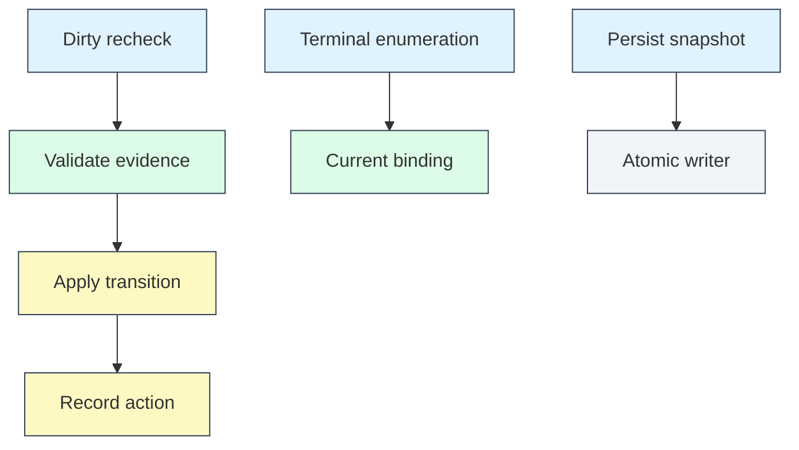

# Refine B1 evidence intake report

查證時間：2026-09-07 09:30 UTC。此文件只交規劃材料與唯讀純函式驗證；不宣稱產品修正、派工、merge、installed 或 live 完成。

## Scope and Authority

隔離 intake 子任務 branch `feature/refine-evidence-intake-20260907`，authoring base `60a3ffa867377b0c86fa2f10e91fb9820d91938c`（已合併 #832）。該子任務只允許本報告及三個 work_id 的 spec/design/todo 共 10 檔；不是 root 後續整合 PR 的完整 diff 範圍：

- `docs/superpowers/specs/fix-dirty-recheck-idempotency-{spec,design}.md`、`docs/superpowers/workstreams/fix-dirty-recheck-idempotency/todo.md`。
- `docs/superpowers/specs/fix-superseded-terminal-replay-{spec,design}.md`、`docs/superpowers/workstreams/fix-superseded-terminal-replay/todo.md`。
- `docs/superpowers/specs/registry-persist-hygiene-{spec,design}.md`、`docs/superpowers/workstreams/registry-persist-hygiene/todo.md`。

Live issues #496/#497/#821 均 OPEN；讀回後以 #832 已接受更正 todo 保留原始 scope/AC，而非退回 issue 的舊假設。隔離 authoring 當下沒有 commit/push、`.cortex` 註冊、issue 修改、code/tests、operator registry/runtime/service 變更；#501 bucket index authority 未碰。產品 todo 要求的 changelog/CI/policy 由後續正式交付補上，不在該子任務 10 檔授權外新增；root 後續整合/提交以獨立紀錄為準，不預述未來 Git 狀態。

## Source and Test Findings

Source/test 基底為 `79ba644780bf1c697c722ac24a297e7d02416100`。`git diff 79ba6447..60a3ffa8 -- paulsha_cortex tests` 無差異，故來源錨點同時適用本 intake base。Runtime tree 有既存 `service-manager.sh` dirty，未改；不宣稱整棵 runtime clean。

| Work | 已實作及有測試的邊界 | 必要差額／不重做 |
|---|---|---|
| #496 | manager.py:394 validator；:426 apply；tests/test_pre_candidate_recovery.py:241 的 dirty cleanup 會前進 | manager.py:2093–2129 驗後仍無條件 apply；registry.py:1650/1673 真正 append。新增 caller-level no-op，保留 #501 current hash 與 immutable writer。舊現場頻率不當本次量測。 |
| #497 | manager.py:164–215 的 manifest shortcut/superseded audit；tests/test_pre_candidate_recovery.py:139 驗 manifest | registry.py:1561–1579 的 None 不清 binding；manager.py:2131–2170 仍枚舉 terminal、:2263–2283 unbound/missing proof 易混淆。補持久 disposition/原子 clear/early admission，不重做 #383。 |
| #821 | registry.py:572–641 atomic replace、rollback/reload；headless test:375 保護 #501 normalization；publication test:553 fault wrapper | 無 digest no-op/有界 history/ownership-safe cleanup；record_action 才是 append fixture。保留 schema/root whitelist/reload 策略，hardlink fallback 與 archive residual 全保留。 |

具體校正：`run_tick`（manager.py:2605–2655）先 scan/fanout 再 complete，不採舊敘述「complete 一定先於 fanout」。#497 分兩個測試面：recover→complete 的純 skip；以及合法完整 run_tick 的一次新 builder。真正缺 repo root 的 early error 不是 replay 被修的證據。

不可變來源與 fixture 已逐項列於三份 spec Evidence；該清冊為當下明確入口佐證，不保證不存在其他 terminal consumer。新 implementation 的 executable invariant 必須對列管入口守門，新增入口未分類應使測試失敗。

## Pure Completeness and Sizing

從 checkout 外執行現行 runtime 的 `planning.py`，`PYTHONDONTWRITEBYTECODE=1`，不建立 registry、不呼叫模型或 capability probe。實讀 packaged `fix-standard`：gate_spine=2、cards=9、persona_binding=9。Sizing 適用全集 R-09/R-16/R-19；不改 combo、persona 或門檻。

| Work | domain/state 的真實邊界 | 現行五維 domain/state/acceptance/stability/orchestration | 現行 band | 同輸入採 #831 定案映射 |
|---|---|---|---|---|
| #496 | 0/1：只改 Manager 一個 production flow；lifecycle hash/state/ref 一致性 | 0/1/2/2/2 = 7 | Red | 0/1/2/0/2 = 5，Yellow |
| #497 | 1/2：registry/manager/work_actions；多持久物件 CAS/restart/proof | 1/2/2/2/2 = 9 | Red | 1/2/2/0/2 = 7，Red |
| #821 | 0/2：單 registry production 模組；disk/memory/digest/history/rollback | 0/2/2/2/2 = 8 | Red | 0/2/2/0/2 = 6，Yellow |

三案 spec/design/plan 均 `accepted`、無 missing kind/blocking marker；task **首行**含 source/tests/documentation，新增 CLI/doc 任務也在 Tasks 下。用真 `plan_review_gate` 檢查三 surfaces 及 R-09/R-16/R-19/R-22：completeness/contract_compatibility 通過，envelope observation 為 `envelope_unavailable` bypass。本次沒有提供或偽造 builder 能力查表；單獨 gate ready 不代表 Red 可派工。

最後欄是**純規格投影**：同一組已 accepted 輸入，按 #831 定案完整 stability risk=0 建立 SizingScore，其餘四維不變；不是 #831 新 runtime 的實測，也未 patch/import 一個假修正版。正式派工必須等 #831 實際交付後重新計分，不能把投影回填歷史 run。#497 即使映射修正仍 Red，必須受治理拆分。

## Preserved Acceptance Mapping

機械比較 #832 baseline Tasks 與新 todo：去除新加 T 編號/分類前綴後，原始 10/13/11 個 task 文字逐項完全相同；每份只新增 2 項 documentation/CLI/intake-gate task。Boundary 與原歷史證據內容保留，英文 Evidence heading 只為文件一致性。下表每一原 parent AC 都有 spec ID 與 todo ID，不漏掉先前明示殘餘。

候選代號只供人工討論，不是 issue/work_id/已註冊 child。D=維持 #496 原工作；S-A/S-B/S-C 與 H-A/H-B/H-C 的定義見下一節。P=parent 整合驗收，不能由 child 單獨宣告。

| Parent AC | Spec／Todo | 人工分工候選 | 關鍵驗證 |
|---|---|---|---|
| #496 validate before gate | D01／T01 | D | runner/validator 仍執行 |
| #496 exact effective tuple | D02／T02 | D | hash/state/gate/candidate/summary/refs 逐欄負例 |
| #496 no-op writes | D03／T03 | D | action/history/update_slice=0 |
| #496 real transition once | D04／T04 | D | 真變更一次、下次不再增 |
| #496 bad evidence | D05／T05 | D | schema/unreadable/mismatch fail-closed |
| #496 10 ticks | D06／T06 | D | 既有基準 count 不變、runner count 增 |
| #496 same path new hash | D07／T07 | D | 受控 fixture、不可放寬 writer |
| #496 cleanup/repair | D08／T08 | D | cleanup 正例與 state/refs 修復 |
| #496 hash compatibility | D09／T09 | D | #501 normalization、contract hash 不改 |
| #496 delivery | D10／T10 | D/P | review/merge/runtime delta 分帳 |
| #497 additive disposition | S01／T01 | S-A | 舊 row/copy/validation 相容 |
| #497 atomic recover clear | S02／T02 | S-A + S-C | 真清 bindings、同次 persist |
| #497 CAS/idempotent request | S03／T03 | S-A + S-C | fault/stale/request replay |
| #497 replacement/consumed | S04／T04 | S-A + S-B + S-C | producers 取代；完整 proof 才 consumed |
| #497 early terminal admission | S05／T05 | S-B | 在 repo/candidate/evidence 前 skip |
| #497 stale zero side effect | S06／T06 | S-B | 舊 artifacts 可讀、current 正常 |
| #497 reachable fixture | S07／T07 | S-C | candidate=None、明設 repo、先驗 allowed |
| #497 complete/full tick | S08／T08 | S-B + S-C/P | complete 不污染；full tick 一次新派工 |
| #497 manifest/restart | S09／T09 | S-B/P | 回 None/missing/corrupt、新 registry |
| #497 multiple jobs | S10／T10 | S-B + S-C/P | retry-build→repin、builder/reviewer |
| #497 completed stable | S11／T11 | S-B/P | 10 ticks proof bytes/依賴不倒退 |
| #497 failure matrix | S12／T12 | S-A + S-B + S-C/P | CAS/fault/replay/missing/current/history |
| #497 delivery | S13／T13 | P | 全部 child/full gates/loaded restart |
| #821 digest no-op | H01／T01 | H-A | mkstemp/inode/mtime、deleted state |
| #821 writer signature | H02／T02 | H-A | dict/optional serialized/fault wrapper |
| #821 digest lifecycle | H03／T03 | H-A | original load、normalization、rollback |
| #821 bounded histories | H04／T04 | H-B | 500/env/constructor、limit1/2、counter |
| #821 load/copy | H05／T05 | H-B | clone input、once-only normalization |
| #821 hardlink fallback | H06／T06 | H-C | link/copy/fsync/rollback 故障 |
| #821 safe startup sweep | H07／T07 | H-C | ownership proof、不只 mtime、單層 |
| #821 persistence tests | H08／T08 | H-A/P | real self-transition、#501/released load |
| #821 append tests | H09／T09 | H-B | record_action 12次/limit5/dropped7 |
| #821 filesystem negatives | H10／T10 | H-C/P | 活躍/unknown/symlink/permission |
| #821 delivery/retention | H11／T11 | P | full gates/loaded writes、必要證據不刪/先備份 |

#496 T11–T12、#497 T14–T15、#821 T12–T13 為新增正式 completeness/CLI/doc/交付守門，不取代或弱化上列原項。

## Manual Split Candidates

1. **#496 優先保留原 work**：production 只在 manager caller gate，#831 後投影 Yellow，無必要強拆。若正式 sizing 因真 scope 擴張仍 Red，才把「純 effective-transition predicate＋逐欄 unit」與「dirty caller 接線＋10-tick regression/delivery」分成有獨立 authority 的候選；D01–D10 仍全回 parent，不把 helper 測綠當整案完成。
2. **#497 必須先拆**：
   - **S-A registry disposition/atomic transition**：row schema/copy/loader、CAS/冪等 receipt、真正 clear、persist fault rollback 原語；不自行清 workspace、改 Manager tick 或造 completion proof。
   - **S-B completion admission/consumption**：以 S-A 原語接 listed builder/reviewer/workflow terminal consumers；current/missing/stale 分離、required proof 完整後才 consumed、manifest/restart/late terminal；不改 fanout/immutable writer。
   - **S-C recovery producer integration**：slice/work recovery、abandon、retry→repin 的窄接線，沿用現有 owner-aware reclaim，不接管 #547 target 選擇；reachable fixtures/full tick。依賴 S-A，與 S-B 共同完成 parent end-to-end。
   - **P 整合 owner**：保存 S01–S13 全 coverage、foreign review、exact-head merge 與 loaded canary/restart，不能由三張 helper spec 的 accepted 狀態自動推成 parent completed。
3. **#821 可在 #831 後原 work 重新裁決**：投影 Yellow，不先為了拆而拆。若實際 envelope/owner authority 或 source 範圍仍要求分解，候選 H-A=digest/writer compatibility；H-B=bounded history/load/copy；H-C=hardlink rollback/ownership-safe sweep。H-A/H-C 共碰 writer 必須順序整合；H-B 與 H-A 要有 normalization-once integration，不能讓各 child 分別綠卻互相遮蔽 digest。

以上候選未新建 issue、未生成 accepted child 文件、未註冊 work、未給猜測 Yellow 分數、沒有 planner Job/child lineage/depth/authority receipt。Root 可裁決採用後再走正式 intake 與真實 sizing；**不是 #833 自動分解的完成證據**。

## Bounded Residuals and Dependencies

- #496 不把 record_action＋update_slice 重寫成全新原子引擎；#497/其他權威已有的 crash/CAS scope 保持獨立。#818 多 manager 共享檔案一致性不由三票暗中修掉。
- #497 parent 仍 Red；S-B 的 consumed 要以已完整 durable proof 為前提，不可先標記後補證；resource reclaim 不是 registry 單檔原子性。#547 保留 target/dual-entry 整體修正。
- #821 的 stale temp 若沒有可信 writer-death 或獨占 authority，只能 skip+診斷；舊 random tmp 缺 metadata 不等於自動可刪。正例 owner fixture 可驗機制，但不能代替 production owner proof。若接線需超出 registry scope，先回 root 重拆，不使用 always-true validator。
- #821 截斷後首/近 history＋counter 不是完整 archive；必要 current/completion evidence 不刪。需全歷史部署必須在受治理備份完成後才啟用截斷，長期 archive 保持 #829 未完成 gap。
- #501 hash 分離已存在，不重做、不改 bucket index authority；本組不改 #833 planner engine，不把 #831 投影當現場新 runtime。

## Read-only Checks

已實跑 runtime `python3 -m paulsha_cortex.cli work start --help`：exit=0、stdout 37 行、stderr 空；`run work --help`：exit=0、stdout 55 行、stderr 空。均在 checkout 外執行，只看 help，不 start/retry/tick、未呼叫 live manager。

純檢查結果：3/3 accepted 三件組、3/3 completeness+contract、原 tasks 10/13/11 全保留；尚未跑產品 focused/full pytest、CI、PR-context policy、installed wheel 或 live canary，不能把上述結果填為其通過。No-op／supersession／hygiene 功能仍待 Cortex 正式實作。

## Bounded Trace

trace_mode: rg；maxDepth=3、maxFanout=10、maxNodes=200。LSP 回報未有可用 Python server；ctags 無 tags、cscope index_exists=false，依 skill 降級，沒有啟動/重建服務或索引。只追指定入口；沒有全 repo 窮舉或跨 scope vault 寫入，trace 併入此被允許報告。

- manager.py:2093:1 dirty_recheck → validator/apply [via=rg conf=0.4]
- manager.py:426:1 apply → registry.record_action [via=rg conf=0.4]
- registry.py:1591:1 record_action → persist [via=rg conf=0.4]
- manager.py:2131:1 terminal enumeration → current slice/manifest [via=rg conf=0.4]
- registry.py:617:1 persist → atomic writer/load rollback [via=rg conf=0.4]



圖按 dirty/terminal/persist 三個 seed 展示有界片段，省略跨片段與錯誤/其他 lane；不是完整 workflow 拓撲。圖表變更：使用短 quoted labels、TD、fill/stroke 成對，每段不超過3層；沒有可用 Mermaid validator，不宣稱工具驗證完成。

```json
{"meta":{"trace_mode":"rg","revision":"79ba644780bf1c697c722ac24a297e7d02416100","limits":{"maxDepth":3,"maxFanout":10,"maxNodes":200},"scope":"selected entrypoints, not exhaustive"},"nodes":[{"id":"dirty","path":"paulsha_cortex/coordinator/manager.py","line":2093,"via":"rg","conf":0.4},{"id":"apply","path":"paulsha_cortex/coordinator/manager.py","line":426,"via":"rg","conf":0.4},{"id":"action","path":"paulsha_cortex/coordinator/registry.py","line":1591,"via":"rg","conf":0.4},{"id":"persist","path":"paulsha_cortex/coordinator/registry.py","line":617,"via":"rg","conf":0.4}],"edges":[{"from":"dirty","to":"apply","relation":"validated recheck"},{"from":"apply","to":"action","relation":"calls"},{"from":"action","to":"persist","relation":"calls"}]}
```

## Reader Review and Handoff

doc-coauthoring 要求的 fresh-reader 已讀指定 10 檔並回 PASS，未報 BLOCKER/MAJOR；確認 planning/implemented、#497 仍 Red、#496/#497 責任、ownership-safe sweep、非完整 archive、34 項 AC mapping 與人工候選非 #833 evidence 都可清楚辨認。其範圍限文件內部一致性，沒有獨立讀 source/#832，不冒充來源複核或產品測試。

作者另以程式讀 #832 原 todo 逐項比對（只移除新 T 前綴）、驗所有 immutable source link 路徑/行號存在、逐檔 whitespace、公開內容無個人路徑/credential pattern，並檢查 worktree 恰好 10 個授權變動。檔案變更為 6 份新增 accepted spec/design、3 份 todo 修改與本報告；沒有 commit/push 或發佈 `.cortex` authority。Root 整合前仍應全文讀回並重新執行純 gate；本子任務不代為關票或派工。

## Pure Check Reproduction

以 `CORTEX_RUNTIME_ROOT` 指定實際要核對的 runtime checkout、`CORTEX_INTAKE_ROOT` 指定本 intake worktree，從 checkout 外執行；全程不寫 registry、不啟動模型。下列 #831 projection 僅對已完整 accepted 的本三案套用已定案的 stability=0，不是新 runtime 的 proof。

```bash
PYTHONDONTWRITEBYTECODE=1 PYTHONPATH="$CORTEX_RUNTIME_ROOT" python3 - "$CORTEX_INTAKE_ROOT" <<'PY'
import json
import sys
from dataclasses import asdict, replace
from pathlib import Path
from paulsha_cortex.coordinator import planning
from paulsha_cortex.coordinator.claim import sizing_band
from paulsha_cortex.deck.schema import DEFAULT_CARDS_PATH, load_cards, load_combo, resolve_combo_path
root = Path(sys.argv[1])
cards = load_cards(DEFAULT_CARDS_PATH)
combo = load_combo(resolve_combo_path('fix-standard'), cards)
counts = dict(gate_spine_count=len(combo.gate_spine), cards_count=len(combo.cards),
              persona_binding_count=sum(cards[e.ref].persona_binding is not None for e in combo.cards))
for slug in ('fix-dirty-recheck-idempotency', 'fix-superseded-terminal-replay', 'registry-persist-hygiene'):
    refs = [('spec', f'docs/superpowers/specs/{slug}-spec.md'),
            ('design', f'docs/superpowers/specs/{slug}-design.md'),
            ('plan', f'docs/superpowers/workstreams/{slug}/todo.md')]
    artifacts = tuple(planning.PlanningArtifact(k, r, (root / r).read_text()) for k, r in refs)
    report = planning.assess_planning_completeness(artifacts)
    assert report.complete
    score = planning.compute_sizing_score(plan_artifact=artifacts[-1], completeness_report=report,
                applicable_contract_rules=planning.ACCEPTANCE_SURFACE_RULES, **counts)
    projected = replace(score, spec_stability=0)
    gate = planning.plan_review_gate(plan_artifact=artifacts[-1],
                acceptance_surfaces=frozenset({'source', 'tests', 'documentation'}),
                applicable_contract_rules=planning.CONTRACT_COMPATIBILITY_RULES, envelope_lookup=None)
    assert gate.ready
    print(json.dumps({'work_item': slug, 'current': score.to_dict(), 'band': sizing_band(score.total),
                      'projection': projected.to_dict(), 'projected_band': sizing_band(projected.total),
                      'gate': asdict(gate)}, sort_keys=True))
PY
```
