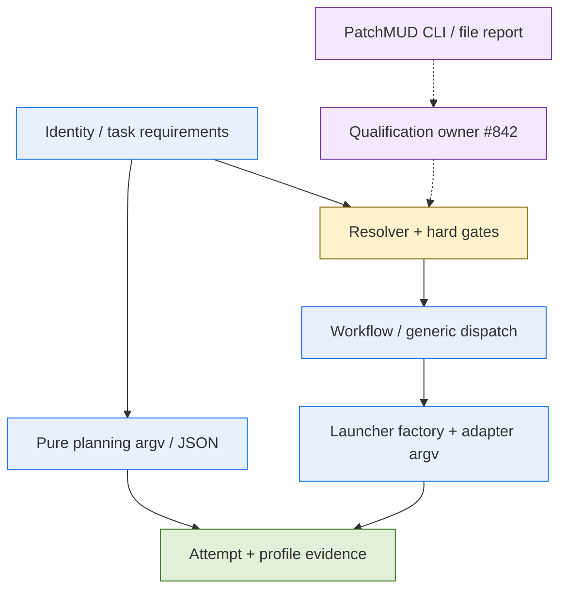

# #835 execution-profile planning intake 審查

日期：2026-09-07。基準：`60a3ffa867377b0c86fa2f10e91fb9820d91938c`（已合併 PR #832）。
branch：`feature/refine-profile-intake-20260907`。本報告與三件組是本次 authoring 唯一新增的四檔；
作者在初稿與本輪修訂當下均未改產品碼／測試／registry／服務，未 commit/push、未開 issue、
未跑模型 probe/benchmark。此為 authoring 當下操作紀錄，不預述 root 後續整合或交付狀態。

## Outcome

完整保留 [#835](https://github.com/hamanpaul/paulsha-cortex/issues/835) A1–A6，
並以 root 後續明確裁定的 [#842](https://github.com/hamanpaul/paulsha-cortex/issues/842)
取代原票「qualification lifecycle 無 owner」的歷史缺口描述。
規劃可完整表示，但 **整件仍 Red，不可直接當單一 Yellow build unit**；
accepted frontmatter 不是 registration/freeze 或 runtime readiness。

## Artifacts

- [Spec](../../docs/superpowers/specs/execution-profile-contract-spec.md)：R1–R6、I1–I10、A1–A6 與 ownership。
- [Design](../../docs/superpowers/specs/execution-profile-contract-design.md)：D1–D6、production consumers、fixture 與 migration 邊界。
- [Todo](../../docs/superpowers/workstreams/execution-profile-contract/todo.md)：完整 source/tests/documentation/CLI/changelog Tasks，未勾產品驗收。

## Trace Method

`trace_mode: rg`；查閱指定 SHA 的原始碼／測試與 GitHub #835/#842/#581/#208，
Python LSP 未提供可用 server，worktree 無 tags/cscope index，故依 skill-code-tracker
降級為有界文字追蹤，不建立索引或啟動服務。`maxDepth=3, maxFanout=10, maxNodes=200, timeout=30s`；
下列為分別選定入口的局部 call/data-flow 合併圖，不宣稱一次追蹤已窮盡全部調用點。
每條文字證據標記 `[via=rg conf=0.4]`；靜態證據是當下佐證，全入口一致性須由 A6 runtime 不變量測試守護。
doc-coauthoring 用於規格／設計／驗收對齊；root 已全文閱讀初版四檔並裁定下述界線，
本輪新增負例仍交 root／reviewer 核對，不以 root 初版閱讀冒充修訂版 fresh-reader 通過。

圖中實線為既有入口間的選定概念資料流，不表示新 profile 已接通；虛線為 producer／qualification
待交付契約。無 Mermaid validator 工具可用，僅靜態語法檢查，未宣稱已渲染驗證。

## Production Evidence

以下路徑均以基準 commit 的 `paulsha_cortex/coordinator/` 為前綴。

| 入口／資料 | Source 錨點與判斷 |
|---|---|
| Identity loader | `model_identities.py:284,349,547`：identity／registry／overlay loader，現有 key 為 executor/model；descriptor profile 需 additive seam `[via=rg conf=0.4]` |
| Role／相容性／排序 | `model_resolution.py:96,151,311,476,622,882`：unknown persona fallback、builder capability、credential/sandbox checks、pair-key roster 與人工 reviewer/date 已存在；不應重做核可政策 `[via=rg conf=0.4]` |
| Workflow 解析 | `manager.py:8119,8219,8466,8535`：候選、排序、preflight、resolution 紀錄；explicit override 先於 measured 篩選返回，不代表新版可豁免最低品質 `[via=rg conf=0.4]` |
| 生產 launch | `manager.py:9373,9683,9697`、`manager_daemon.py:591,616,1031`、`autonomy.py:602,688`：workflow／generic lane factory 仍主要傳 identity pair，specialized launcher 另做相容性檢查 `[via=rg conf=0.4]` |
| Adapter／CLI | `cli.py:30`、`launcher.py:797,1072,1341,1369,1424,1439,1912`：CLI factory 尚未帶完整 profile，effort/argv 有分散產品處理；as_* clone 已帶 effort，不誤列成漏傳缺陷 `[via=rg conf=0.4]` |
| 純規劃 | `planning_runtime.py:68,85,95,101,1329`：獨立 argv 與 JSON invocation，不能只修 SubprocessLauncher；保留 hermetic config、純 JSON／零工具安全契約 `[via=rg conf=0.4]` |
| 持久化 | `workflow.py:45,65,456,707,797`、`registry.py:646,1047,1962`：嚴格 legacy chain schema 與 JobRegistry；新 profile 不能直接注入舊 strict dictionary `[via=rg conf=0.4]` |
| 評測接縫 | `model_profile.py:146,246,260,329`、`envelope_mapping.py:233,287,333`：report grouping／原子檔替換／舊六欄 fingerprint／coverage 侷限；不是完整 profile qualification lifecycle `[via=rg conf=0.4]` |

## Owner Boundaries

#581 原五項維持原 owner：doctor planning identity、unknown persona、非 dispatch provenance、
doctor overlay 公開 API、eval producer 管線；本件只消費共用 role/provenance/producer seam，
不增加第六項 qualification 發布工作。#842 獨立擁有發布／撤銷／有效期／human-review receipt／CAS／crash。
沿用 #534 的核可政策與 `map_report_to_envelope`，不把測量 pass 當授權。
[PatchMUD #37](https://github.com/hamanpaul/paulsha-patchmud/issues/37) 是 CLI/file schema
與 immutable fixture 上游，零 runtime import；價格 provenance 不進能力 fingerprint。
真 qualification 依 #842 政策若需真人 receipt，fixture／agent review／plan accepted 不可替代。

## Pure Sizing

完整 scope 的 domain_breadth=2：涉及 identity/resolution、adapter/launcher、planning runtime、
registry/workflow 等至少四個 production 模組且跨執行／持久化資料流，不把 tests 數量當 breadth。
state_consistency=2：#208 原 rubric 明列 migration、atomicity 或 concurrency 任一即 2，本件包含 migration。
invariant_count=10，對應 Spec I1–I10；artifact_classes 為 source/tests/documentation，CLI 與 changelog
仍在 Tasks 首行獨立標記。未刪 AC 或漏宣告以壓低分數。

`feature-oneshot` 實際 loader 得 11 cards、11 persona bindings、4 core gates；
`ACCEPTANCE_SURFACE_RULES={R-09,R-16,R-19}`，acceptance_signal=7，因此 acceptance_surfaces=2、orchestration=2。

| 算法 | domain | state | acceptance | spec_stability | orchestration | 總分／band |
|---|---:|---:|---:|---:|---:|---|
| 基準 `planning.compute_sizing_score` | 2 | 2 | 2 | 2 | 2 | 10 / Red |
| #831 修正完整／穩定規劃為 0 的預計情境 | 2 | 2 | 2 | 0 | 2 | 8 / Red |

第二列只是保持其他輸入不變的推算，不表示 #831 已合併或 installed；修正後須重跑真實 runtime sizing。
`planning.py:859` 的舊公式讓完整三件組得到 2，是 #831 已列管的方向問題。
`claim.py:1497` 的 band 門檻為 Green 0–3、Yellow 4–6、Red 7–10，本件兩種算法均 Red。

## Manual Split Candidates

以下只是 root 人工規劃候選，不是已開 issue／已註冊 work_id、不是 #833 自動分解成果，
也不預判各候選必為 Yellow。獨立 child 必須真實重算與檢查未遺失 parent AC，parent 仍持有整合／closeout。
root 本輪只採 `execution-profile-schema-core` 優先；其餘候選待誠實重評與再拆，尚未核可整包進件。

| 建議 child work_id | 單一 ownership／不接管 | 前置 | Parent AC mapping |
|---|---|---|---|
| `execution-profile-schema-core` | 純 schema、canonicalization、unknown 與 key；不接 adapter／registry migration | 無；採 #835 凍結契約 | A1 資料擴充、A4 全部、A5 parser 負例 |
| `execution-profile-adapter-consumers` | adapter protocol、launcher／CLI／planning runtime 與離線 conformance；不接 resolver 選擇或資格發布 | schema-core | A1 實際 argv、A2 全部、A6 launcher/planning 回歸 |
| `execution-profile-identity-resolution` | identity descriptor loader、resolver 硬條件、public role／qualification consumer seam；不寫 durable attempt | schema-core；#581 role；#842 查詢契約可先 fixture | A1 候選擴充、A3 全部、A6 resolution／per-work chain |
| `execution-profile-attempt-binding` | manager/daemon/generic factory 接線、WorkflowRun/JobRegistry versioned binding、restart／migration；不重做 #842 lifecycle | 前三 child；#581 provenance seam | A5 全部、A6 production 跨入口／歷史不變 |

schema-core 若確實只有單模組純資料流，可宣告 domain=0/state=0；不得先以此值代替獨立 scope 審查。
adapter consumers 跨多個入口，resolver 與 attempt-binding 又各自含多模組；最後一項含 migration，
仍可能 Red。若如此，先再拆「嚴格序列化 schema 相容」與「owner-aware 新 attempt 接線／migration」，
維持同一 JobRegistry 真值及端到端 AC，不以刪 restart／production consumers 避免 Red。
自動分解 #833 未實作不妨礙 root 人工規劃，但不能假造子件 authority 或跳過正式 freeze。

最小依賴 DAG：schema-core → adapter-consumers／identity-resolution；前三項 → attempt-binding；
schema-core 的凍結 key 契約 → #842，#581／PatchMUD #37 → producer fixture／#842。
#842 的真 consumer 結果與各 child → parent A6 整合／closeout。#842 依賴 key 契約 child，
不等待 #835 整個 parent 已關閉，避免「#835 整合需 #842、#842 又等整件 #835」的人為循環。

## Validation Ledger

- 規劃純 helper：以基準 checkout 的 `python3 -B` 直接讀三件組，`assess_planning_completeness.complete=true`，三個 artifact accepted、缺 kind／blocking markers 均空。
- 真正 `compute_sizing_score` 及 `work_bridge.current_sizing_snapshot` 均得到 `10/red`；保留其餘維度、以 `dataclasses.replace(spec_stability=0)` 推算 #831 情境為 `8/red`，未改產品算法。
- 真正 `_evaluate_yellow_plan_review` 的 completeness／contract compatibility 通過；另以 `plan_review_gate` 明確加入 CLI surface 與 R-22 亦通過。但兩次 envelope 均是 `bypass: envelope_unavailable`，**不是 builder qualification 通過，也不能把 Red 派成 Yellow**。
- 離線負控制：只在記憶體中替換 spec 的 Requirements 或 plan 的 Tasks 標題，分別被 completeness／plan-review completeness 拒絕，未改真檔或執行產品測試。
- 四檔行尾／whitespace、11 個相對連結、引用的既有 test 路徑與無個人絕對路徑均通過；`git diff --check` 通過，`git status --untracked-files=all` 僅列本次四檔，無 tracked 產品 diff。
- 產品 implemented／tests passed／merged／installed／live accepted：均未完成，本 planning-only 任務未執行。
- Root 已全文讀初稿四檔；本輪負例與裁決文字待 root／reviewer 核對。已承認、有界且列管的外部依賴不單獨構成 FAIL。
- 未處置實質缺陷或遺失 AC 則 FAIL；若 reviewer 不接受某殘餘風險，須指出具體影響與可行替代。

## Root Review Decisions

2026-09-07 root 在全文閱讀四檔後接受 D4：只保留既有 frozen legacy run 的原可證 schema／policy，
新的 profile-aware run 不得繼承品質 bypass；這是規劃裁決，不是產品行為已驗證，也不是任何 run 的
重新接受、runtime 操作或真人 qualification 授權。

root 要求補入的負例已映射到 Spec R5／A5、Design D4／A5 及 Todo T10：歷史 run 沒有足以
重建當時 schema／policy 的可信 snapshot 時，標 legacy/unversioned/unknown，不猜填今天或某個
舊版本、不回寫原 chain；需正式且具 authority 的重新接受才可切到新版。這條驗收仍未執行產品測試。

#842 依 schema-key child 的凍結契約而非整件 #835 close 的 DAG 已獲接受；root 僅先採 schema-core
優先，其餘 child 仍須誠實重評／再拆，尤其 attempt-binding 仍可能 Red。
本輪未開票、註冊或給任何模型／agent／effort 固定組合；本次四檔 SHA-256 由外部工具實算交接，
不將報告自己的 hash 嵌回本檔形成自引用，也不代寫任何產品 evidence hash。

## References

- [#829 完整精修 umbrella](https://github.com/hamanpaul/paulsha-cortex/issues/829)、[PR #832](https://github.com/hamanpaul/paulsha-cortex/pull/832)。
- [#208 sizing／freeze rubric](https://github.com/hamanpaul/paulsha-cortex/issues/208)、[#831 sizing 方向修正](https://github.com/hamanpaul/paulsha-cortex/issues/831)、[#833 Red 分解](https://github.com/hamanpaul/paulsha-cortex/issues/833)。
- [#581 解析與 producer 殘項](https://github.com/hamanpaul/paulsha-cortex/issues/581)、[#534 分層核可政策](https://github.com/hamanpaul/paulsha-cortex/issues/534)、[#205 per-work chain](https://github.com/hamanpaul/paulsha-cortex/issues/205)。
