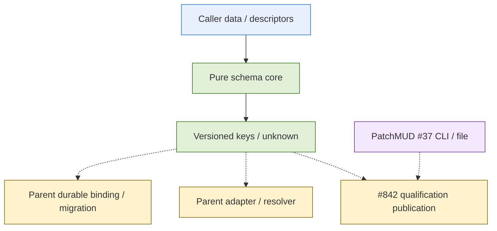

# #835 schema/key core child planning 審查

日期：2026-09-07。branch：`feature/refine-profile-schema-child-20260907`。
authoring 基底為當下 `origin/main` `fb31083e7325be86c6c9d217da56b9c4d799f5a5`；
先 inventory 確認新 branch/path 不存在，再開隔離 worktree，只在新 worktree 做 `pull --ff-only origin main`，
結果 already up to date。未改 operator/runtime／services；authoring 當下只新增本報告與三件組，無 commit/push。

## Authority Readback

完整讀 [PR #848](https://github.com/hamanpaul/paulsha-cortex/pull/848) 的母 spec/design/todo/report。
首次 GitHub 查得 head `0da1bfa026899e46df990a9b65d40dfc9fec6f31`，隨 root 通知更新至
`be59f769786eeee2e1f97e073c722d8e49272653`；精確比較證明三檔 bytes 不變，Todo 只有
artifact_classes inline→block、值不變，已全文重讀最新 Todo，不拿不同 HEAD 的 checkout 冒充同一版本。
#835／#842 issue 全文另已讀回；母件 qualification owner 舊 gap 依後續 #842/root 裁決收口。
Authoring 階段未開 issue／registration；root 後續已建立 #849 並於本批登錄，
尚未 freeze／dispatch，不改 PR #848 或母件四檔。以下歷史審查依其當時階段閱讀。

## Outcome

可把 T01/T02 的純資料切面限制為一個新 production module；不需要先改現有 consumer。
但這是新版本化 schema，不只是無資料契約的運算；依 #208 state/consistency rubric，
`domain_breadth=0, state_consistency=1`。母件「schema-core 可能 0/0」僅是未審候選，不沿用其暫估。
母件 T02 的 legacy migration 不在此拆分；母 T05/T10 仍持有，沒有透過刪 AC 消失。
Root 本輪接受新版本化資料契約的 state=1 分析，要求保留 vocabulary 權責、合法升版負例及
既有 consumer 未接線的界線；此裁決不等於產品完成或真人資格批准。

## Artifacts

- [Spec](../../docs/superpowers/specs/execution-profile-schema-core-spec.md)：R1–R6、I1–I10、C01–C10 與母 A1–A6 全對照。
- [Design](../../docs/superpowers/specs/execution-profile-schema-core-design.md)：單 module 純 API、原生 grammar、key/metadata、合法升版及 consumer 邊界。
- [Todo](../../docs/superpowers/workstreams/execution-profile-schema-core/todo.md)：source/tests/documentation/CLI/changelog 首行 Tasks，產品項目均未勾。

## Source and Consumer Seams

`trace_mode=rg`，Python LSP unconfigured、worktree tags/cscope index 皆無；不建索引或啟動 server。
有界選定入口：maxDepth=3、maxFanout=10、maxNodes=200、timeout=30s；各錨點 `[via=rg conf=0.4]`。
以下以 authoring 基底的 `paulsha_cortex/coordinator/` 為前綴；只作當下局部證據，無全稱無其他 caller 宣稱。

| 現有 seam | 證據與本 child 邊界 |
|---|---|
| `model_identities.py:284,349` | 現有 identity/registry 嚴格 schema；不加新欄位、不換 loader。新 core record 獨立於既有身份註冊 |
| `model_resolution.py:476` | EvalRosterEntry 為 executor/model key 並有 approved/roles；#842 日後消費 core key，不在本件重寫資格政策 |
| `model_profile.py:260`、`envelope_mapping.py:287` | 舊 fingerprint 六欄不等於 actual-condition key；新 API 不默默替換它、不重算舊 evidence |
| `workflow.py:45,65` | frozen chain 嚴格欄位集合；新版 binding／legacy migration 留母 child，不往舊 dict 塞 profile |
| `verification.py:58` | 現有一般 JSON hash 不定義 native float 跨 producer canonical 政策；新純 module 用 stdlib 建 typed canonical tree，不 import 此含其他 runtime dependencies 的模組 |
| `coordinator/__init__.py:3` | 既有 package imports 保持不變；直接 import 新 module 不需新增 export，也不代表其他 consumer 已接線 |

圖為待實作契約依賴，不是已存在 runtime call graph。虛線全部留 downstream owner，
#842 只依 core schema/key，不等 #835 整件 close。Mermaid 未經 renderer 驗證，僅作小型依賴示意。

## Pure Gates and Sizing

純 gate 使用既有 runtime checkout `79ba644780bf1c697c722ac24a297e7d02416100` 的 planning/manager/
work_bridge，從 checkout 外以 `python3 -B` import，核對 module.__file__，不執行 dispatch/probe。
這是 runtime 版本的純函式檢查，不是 active daemon 已載入新 core，也不是產品行為測試。
套用 packaged feature-oneshot：11 cards、11 persona bindings、4 core gates；R-09/R-16/R-19 全集，
故 acceptance_surfaces=2、orchestration=2。invariant_count=10 對應 Spec I1–I10，非壓分清單。

| 情境 | domain | state | acceptance | stability | orchestration | 分數／band |
|---|---:|---:|---:|---:|---:|---|
| 79 runtime 真算法，完整 accepted 三件組 | 0 | 1 | 2 | 2 | 2 | 7 / Red |
| #831 完整／穩定規劃=0，其他維度不變的投影 | 0 | 1 | 2 | 0 | 2 | 5 / Yellow |

第二列只做算術投影，未替換 runtime 函式、未假裝 #831 已安裝；真修正後須重跑正式 gate。
當前 Red 不得直接派單一 builder；schema 的 state=1 不因純函式實作或想得到 Yellow 而改 0。
本輪 helper／負控制／link／whitespace 實際結果如下，不以文件自身宣告當 pass。
此單 module 的 schema 與 key 共用同一版本化資料契約；再把 state 宣告切為 0 沒有事實依據。
若 root 要繼續進件，需先等 #831 真實修正後重算，或依正式 Red 路徑重裁；本件不自動分解或派工。

## Validation Ledger

- 首輪獨立 review 為 FAIL／1 MAJOR：舊 D4 未固定 node tags／shape、完整 projection、JSON bytes 與 framing，
  `["integer","1"]`／`{"type":"integer","value":"1"}` 都可能被解讀為符合舊文字卻產生不同 key。
  Root 已採納此缺陷；本修訂直接替換 D4，並補 D1–D3 精確欄位與型別，不保留相互矛盾的 encoding。
- 獨立 R2 為 PASS，root 以 JavaScript encoder＋sha256sum 再驗 actual 920/963、observed 1227/1272
  bytes 與完整 golden 吻合；root 已確認原 1 MAJOR 處置完成，不沿用上一輪未關閉的暫態。
- Fresh reader 五問理解正確，但另找出三項真歧義：D6 core wire 與 adapter protocol 值升版混淆、
  D5 計數／早停未定義、D1 portable reference grammar 缺席。本次已補文字，fresh-reader 再確認尚未收口，
  當時不拿 R2 PASS 冒充這三項也已驗收；後續 fresh reader 已逐項確認修訂清楚。
- Root 接受 D5 分層：depth=16、nodes=4096、完整 J(T(descriptor/profile)) 合計 65536 bytes；
  root/keys 計入、depth 取 max、nodes/bytes 取 sum，native 路徑同 metric。每份 JSON text 另有
  1048576-byte 有界讀取 guard，錯誤分類與作用範圍獨立；只保證 transport 界內等價排版同 semantic
  裁決，超大 padding 可先拒絕，不宣稱任意 input 常數成本。固定正負邊界已加入待實作 AC/Tasks。
- 本輪記憶體計數驗算得到 golden descriptor+profile depth=5/nodes=144/semantic bytes=1740；
  已構造上述四組精確邊界、分開皆未超界而合計超界、等價 compact/pretty/escaped/native、共享 alias
  重複計數與循環 fixture；reference 正負字面值及 1024/1025-byte 邊界也已驗算。D4 兩筆 canonical
  bytes／SHA-256 再讀回皆不變。這些是規劃 fixture 算術，不宣稱產品 parser 的 early-stop 已實作或通過。
- D6 的需升版 protocol/shape 現明確只指 core wire/encoding；adapter protocol/version 新值仍
  descriptor-only 且 key 自然改變。D1 ref 是有界 ASCII namespace:body opaque grammar，無 URL
  白名單／dereference／credential scanner；語法合法不替代 producer/#842 的 provenance 真偽／政策。
- 新 D4.1–D4.4 為 normative：JSON token→integer/binary64、duplicate-key／surrogate 拒絕、完整
  record/actual projection、七種固定 tagged-array node、UTF-8／control escaping、NUL＋uint64_be length
  framing。metadata 排除、三層分立、unknown 不授權與母件 scope 都未放寬。
- 文件中的完整 profile 與兩行 canonical payload 已直接讀回，由不 import Cortex 產品的 in-memory
  獨立 encoder 對照：actual C=920/F=963 bytes、observed C=1227/F=1272 bytes，兩把完整 key 與
  文件逐 byte 相同；每個 framed digest 再經外部 `sha256sum` 交叉核對。
- 五個完整 profile 的 int 1／float 1.0／string "1"／+0.0／-0.0 actual key 均吻合文件、兩兩不同。
  獨立 parser 檢查 int 9007199254740993 不經 double、1e0 等同 float 1.0、-0e0 保留負零、
  -0 為 integer 0、合法 surrogate pair 可解碼、underflow 保留負零；escape 後重複 key、NaN、Infinity、
  overflow、lone surrogate、+0.0／01 非法 token 均拒絕。這是文件數學／JSON 契約驗算，不是新產品 parser 已通過測試。
- 另實算 node tag 改寫／直接 hash C／錯 projection 保留 metadata 不能命中 golden；只改 excluded
  metadata/provenance 不改 actual key；control／非 ASCII／斜線 vector 按精確 escaping 與排序成立。
- 實際 `assess_planning_completeness`：complete=true；spec/design/plan 均 accepted=true，missing、reasons、blocking markers 全空。
- 實際 `compute_sizing_score` 為 7/Red；`current_sizing_snapshot` 從三個真實相對路徑讀回亦為 `(7, red)`。
  只以 dataclass 的 spec_stability=0 另算 #831 投影 5/Yellow，未改函式或檔案。
- 實際 `_evaluate_yellow_plan_review`：ready=true；completeness／contract_compatibility／envelope 三步皆跑，
  最後一項 observations 是 `bypass: envelope_unavailable`。這只代表現行 helper 結構檢查過關，
  不證明任何 measured envelope／真人授權，更不能越過目前 Red band。
- 額外直接 `plan_review_gate` 明示 source/tests/documentation/CLI，適用 R-09/R-16/R-19/R-22：ready=true，
  envelope 同為 unavailable bypass，不宣稱真 CI 或 policy_check 已跑。
- 四個 in-memory 負控制均拒絕：移除 Spec 的 Requirements 標題→completeness=false；移除 Todo 的 Tasks
  標題→failed_check=completeness；注入明示測試 envelope invariant_count=9、三個 artifact classes→
  failed_check=envelope／envelope-exceeded；把 state_consistency 改成 bool true→ValueError。
  此 envelope 僅供負控制，不是實際模型的測量或 qualification 資料；四個變體皆未寫入檔案。
- 四檔 newline／逐行尾端 whitespace／個人絕對路徑檢查通過；7 個相對 Markdown links 與 5 個既有
  regression test 路徑均存在。新 core module／新測試只是待實作落點，未當成存在的成果。
- 產品 core implemented／產品 tests／merge／package import／installed／live：本 authoring 未執行，均非完成證據。
- 原 MAJOR 已於 R2 關閉；本次三項 fresh-reader 澄清的再確認在後續完成。技能 doc-coauthoring
  用於母 AC／child scope 對齊，不代替 fresh-reader 或正式 authority。

## Bounded Residuals

1. 新 core 不能驗外部 observed/provenance 真偽；有 key 不是 measured/qualified。#842 另驗 exact profile、
   role/deck/coverage、receipt 與真人政策，不能把 schema 測試 fixture 當批准。
2. 原生 grammar 是有界 subset，不承諾任意新 core wire 協定零碼；未知 core shape/version 拒收。
   新增合法 descriptor 值（含 adapter protocol/version）不改 core；新的 core wire/encoding 契約才需升版，
   真 adapter 接線／conformance 仍由原 owner 驗收，不固定模型／agent／effort 清單。
3. 母 A2/A3/A5/A6 的 adapter／resolver／state migration／真 producer/consumer 與 installed/live 仍未交付。
   frozen legacy snapshot 無法證實時不得猜補原 schema/policy；本件只拒收不轉換，由母 child 走正式重新接受。
4. #581 五原 scope、PatchMUD #37 外部 producer 與 #842 lifecycle 都保留，不作本 core 的反向完成依賴。
   downstream 可對本純 API 開發 fixture，不可藉此宣稱 routing 已改用新 module。

## References

- [#835](https://github.com/hamanpaul/paulsha-cortex/issues/835)、[#842](https://github.com/hamanpaul/paulsha-cortex/issues/842)、[#581](https://github.com/hamanpaul/paulsha-cortex/issues/581)。
- [PR #848 母 Todo](https://github.com/hamanpaul/paulsha-cortex/blob/be59f769786eeee2e1f97e073c722d8e49272653/docs/superpowers/workstreams/execution-profile-contract/todo.md)。
- [#208 rubric](https://github.com/hamanpaul/paulsha-cortex/issues/208)、[#831](https://github.com/hamanpaul/paulsha-cortex/issues/831)、[#833](https://github.com/hamanpaul/paulsha-cortex/issues/833)。
